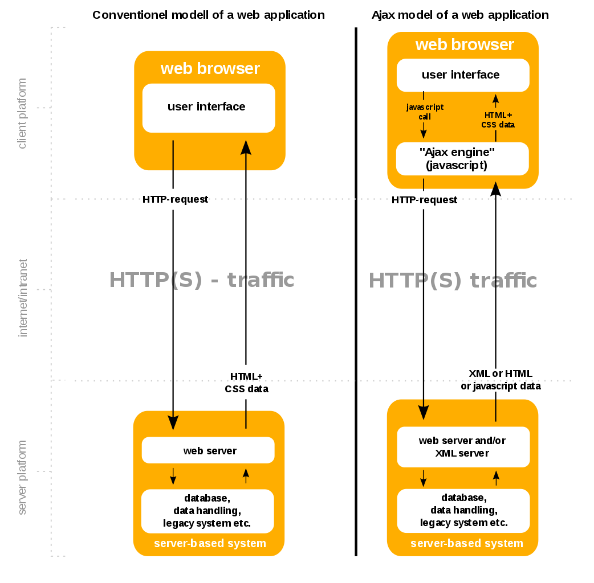
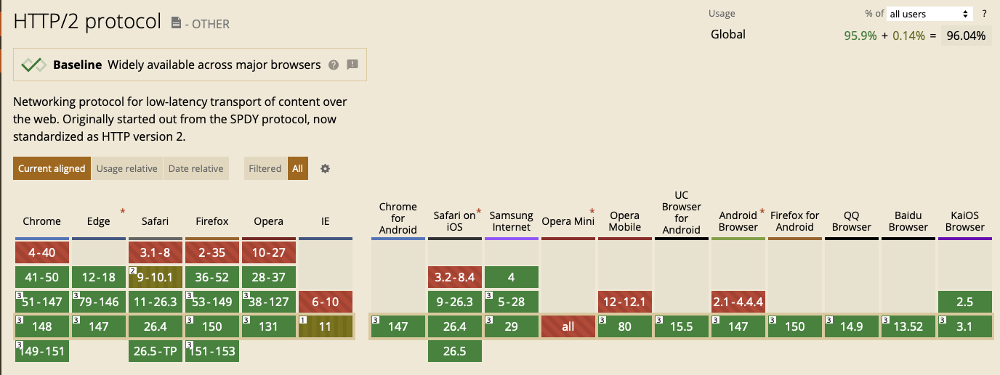
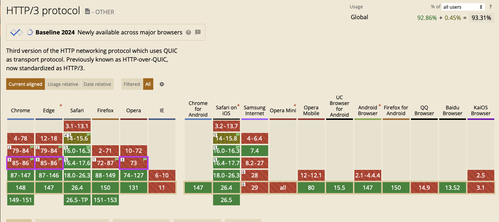

#+BIBLIOGRAPHY: ../bib plain

\begin{frame}[title={bg=Hauptgebaeude_Tag}]
  \maketitle
\end{frame}

* Basic structure

*** Case study: World Wide Web – Basic architecture

 Basic architectures \ac{WWW} very simple
 - Web servers provide "web pages"
 - Identified by a \ac{URI}
   - Resource: Target of a request; nature not specified
   - Reachable at a \ac{URL}
 - Pages formatted in \ac{HTML}
 - Web browsers request pages from servers
 - Server and browser communicate using \ac{HTTP} 
   - HTTP/1.1:
     - Current: RFC 9110, RFC 9112 
     - Superseded: RFC 7230 \textendash{} 7235

Compare \cite[Sect.\ 2.4]{Coulouris:DistributedSystems:2011}

*** Resources and representation 

- Resource: could be anything; type not fixed 
- Representation \cite[Sec.\ 3.2]{RFC9110}:

#+BEGIN_QUOTE
a "representation" is information that is intended to reflect a past,
current, or desired state of a given resource, in a format that can be
readily communicated via the protocol, and that consists of a set of
*representation metadata* and a potentially unbounded stream of
representation data
#+END_QUOTE

*** Metadata

- Header fields provide metadata about representation 
- Example for relevant fields:
  - Content-Type \cite{RFC2046}, e.g., ~text/html;charset=utf-8~
  - Content-Encoding, e.g., compression information like ~gzip~
  - Content-Language, natural-language information \cite{RFC5646}
  - Content-Location, absolute or relative URI  
  - Accept (request & response version): which content types are understood
    - Opens venue for content negotiation between client and server 

 
** HTTP

*** The request/reply protocol: HTTP

 HTTP essentially a simple, cleartext protocol
\pause 
 - Request primitives
   - GET: Obtain content of URL of interest
   - HEAD: Similar to GET, but only provide meta data, not actual content 
   - POST: Provide URL corresponding to a program that can accept the
     data provided in the POST message
   - PUT: Provide URL where the data provided in the PUT message should be stored 
   - ... plus various others (DELETE, OPTIONS, TRACE)
\pause 
 - Reply: Return page, plus error code, status, ... 
   - REDIRECT: Important example, error code telling the browser to
     use the returned URL instead

*** Requests: Static and dynamic content   

GET requests can refer to a static web page (simply delivered by the server) or to execution of a program 
 - Server might make simple modifications to a page during delivery,
   triggered e.g. by “server side include” instructions
 - Server might also compute the request page on the fly, depending on
   parameters in the request
 - Typical: “?” to signal that, key=value pairs separated by “&”
 - Example GET: \url{http://somewhere.net/some/path/somewhere?key=somekey&param1=xyz&param2=abc}
 - Compare \url{https://www.rfc-editor.org/rfc/rfc9110#section-9.3.1}

\pause

**** PINGO!                                                      :B_alertblock:
     :PROPERTIES:
     :BEAMER_env: alertblock
     :END:

     Quiz: A user requests a URL like /news?id=42 and the server
     queries a database to build the page. Is this static or dynamic
     content?

*** Requests and state 
 - Convention: GET does not alter state of resource 
 - POST requests refer to a program execution
   - Compare \url{https://www.rfc-editor.org/rfc/rfc9110#section-9.3.3}
   - POST provides parameters to the program
   - Parameters usually depend on user input 
   - Typically, POST will alter state 
   - Output of the program is delivered back to the client and rendered as the page

\pause

**** PINGO!                                                      :B_alertblock:
     :PROPERTIES:
     :BEAMER_env: alertblock
     :END:

     Quiz: By HTTP convention — does GET alter server state? Does POST?

*** POST and parameters 

- In GET, parameters typically carried as part of the URL
  (...?key1=value1&key2=value2) 
- In POST, URL usually not modified
- With usual content types, parameters are instead part of the message
  body
  - Again using key=value syntax
  - Usual content type: ~application/x-www-form-urlencoded~

*** Header fields in HTTP 

In addition to the metadata-describing header fields, protocol
fields are defined: 
- Request: 
  - Host: Target domain
  - Authorization: Which user?
  - User agent: which browser, which OS? (and things like which
    display resolution, \dots) 
- Response:
  - Set-Cookie
- Both:
  - Cache control 
  - Security headers (see end of the chapter) 

** Web servers
   :PROPERTIES:
   :CUSTOM_ID: sec:web_servers
   :END:

*** Servers 

- Main job: Serve static files 
- Do not write your own webserver 

#+BEAMER: \pause

- Example full-scale servers
  - \href{https://httpd.apache.org}{Apache HTTPD}
  - \href{https://www.nginx.com}{Nginx}
  - \href{https://www.iis.net}{Internet Information Services}

#+BEAMER: \pause
- Example simple servers
  - Python's \href{https://docs.python.org/3.9/library/http.server.html}{http.server}
  - npm's \href{https://www.npmjs.com/package/http-server}{http-server}

*** http.server Example 

**** Basic                                                        :B_example:
     :PROPERTIES:
     :BEAMER_env: example
     :END:
\footnotesize
#+BEGIN_SRC python 
def run(server_class=HTTPServer, handler_class=BaseHTTPRequestHandler):
    server_address = ('', 8000)
    httpd = server_class(server_address, handler_class)
    httpd.serve_forever()
#+END_SRC

**** Serve files from directory                                   :B_example:
     :PROPERTIES:
     :BEAMER_env: example
     :END:

\footnotesize
#+BEGIN_SRC python 
import http.server
import socketserver

httpd = socketserver.TCPServer(("", 8000), http.server.SimpleHTTPRequestHandler)
httpd.serve_forever()
#+END_SRC     

*** http.server from command line 

Serve all that is in \ac{CWD}

**** Defaults 

#+BEGIN_SRC bash 
$ python3 -m http.server
#+END_SRC

**** With parameters 
#+BEGIN_SRC bash 
$ python3 -m http.server 8888 
#+END_SRC

*** NPM http-server 

#+BEGIN_SRC bash 
$ npm install http-server -g
$ http-server [path] [options]
#+END_SRC

Options: path, address, show directories, server gzips, proxy
unresolvable request, ... 

*** Nginx 

- Actually, more than a simple web server for static files
  - Application platform, load balancer, microservices, content
    caching
- With open-source and commercial versions 
- Structure: One master, multiple worker processes
  - Master: configure, control workers
    - Configuration files as input 
  - Workers: do actual work, requests distributed to workers

*** Nginx as web server                                         :B_quotation:
    :PROPERTIES:
    :BEAMER_env: quotation
    :CUSTOM_ID: nginx_config
    :END:
  
- Idea: depending on URL, serve files from directories or forward to
  other "locations" 
- Order in configuration file matters 

**** Configuration                                                :B_example:
     :PROPERTIES:
     :BEAMER_env: example
     :END:

\footnotesize
#+BEGIN_SRC bash
http {
    server {
	listen 127.0.0.1:8080;
	server_name example.org www.example.org;
	location /images/ { root /data; }
	location /wrong/url { return 404; }
	location /permanently/moved/url {  return 301 http://www.example.com/moved/here;
					}
	location /users/ {  rewrite ^/users/(.*)$ /show?user=$1 break;}
	location / { proxy_pass http://www.example.com;
		   }
    } }
#+END_SRC

* Server-side programmability

** Issue? 

*** Jobs of a typical HTTP server 

- Parse requests, schedule delivery 
- Obtain static content from disk, cache
- Compute dynamic content
  - Based on user input, local user information, ... 

#+BEAMER: \pause

- Questions: 
  - What is always the same, what needs to be adapted?
  - What happens often (hence has to be fast), what happens rarely? 

*** Often vs. rare? 
- Happens often and is usually the same
  - Parsing requests 
  - Delivering static content
  - E.g., media files, images, style information, ...
  - Happens in practically all requests 
- Happens rarely: Individual processing 

*** Division of labor 

Hence division of labor:

  - Highly optimized program for parsing request, static content
    delivery
    - A *web server* in the narrow sense of the word
  - A *web framework* to provide context for customized computation of
    dynamic responses (a *web application*) 
    - Examples: Django \url{https://www.djangoproject.com}, Tomcat \cite{ApacheTo2:online}, Ruby on Rails
      \url{http://rubyonrails.org}, Play \url{https://www.playframework.com}, ...
    - Lots of fanboyism \textendash{} but some good comparisons
      (\href{https://en.wikipedia.org/wiki/Comparison_of_web_frameworks}{Ref1},
      \href{https://softwareengineering.stackexchange.com/questions/102090/why-isnt-java-used-for-modern-web-application-development}{Ref2})

*** Web frameworks 

Good frameworks support: 

- Mapping URLs to pieces of code (*URL routing* or *dispatching*)
  - To individual objects, URL parameters passed as parameters to
    methods 
- Templating for Web pages, form validation  
- Security/authentication/authorization 
- Database integration, caching
  - Often: \ac{ORM}
- AJAX support, Javascript integration 
- Often: Model/view/controller abstractions 

*** Side remark: Model/view/controller abstraction 

****                                                           :BMCOL:
     :PROPERTIES:
     :BEAMER_col: 0.5
     :BEAMER_opt: [c]
     :END:

- Old concept how to structure graphical user interfaces (and similar)
  \cite{Fowler:GUIArchi61:online}\cite{krasner1988description}\cite{950428}\cite{Gamma:DesignPatterns:1995:DPE:186897} 
- Components:
  - Model holds data, rules, logic
  - Views convert model into user-useful representations 
  - Controller accepts user input, sends commands to model (or
    sometimes to views) 

****                                                    :BMCOL:
     :PROPERTIES:
     :BEAMER_col: 0.5
     :BEAMER_opt: [c]
     :END:

#+CAPTION: Model/View/Controller concept
#+ATTR_LaTeX: :width 0.75\linewidth
#+NAME: fig:mvc:concept
[[./figures/mvc.pdf]]

** Some Web framework examples
*** A short list of frameworks   

- Python world: 
  - \href{https://werkzeug.palletsprojects.com}{Werkzeug}
  - \href{https://flask.palletsprojects.com}{Flask}
    - Based on werkzeug 
  - \href{https://twisted.org}{Twisted}
  - \href{http://www.tornadoweb.org/en/stable/}{Tornado}
- Javascript world:
  - \href{https://expressjs.com}{Express}
  - \href{https://github.com/fastify/fastify}{Fastify}
  - \href{https://www.meteor.com/developers}{Meteor}
- Java (\href{https://zeroturnaround.com/webframeworksindex/}{compare}, \href{https://www.dailyrazor.com/blog/best-java-web-frameworks/}{comparison}) 
  - \href{https://spring.io}{Spring} 
  - \href{https://www.playframework.com}{Play}
- Quickly moving landscape, cmp. e.g.,
  \href{https://nordicapis.com/10-top-web-development-frameworks-for-2022/}{2022
  comparison}

  
*** Werkzeug 

Absolute minimum functionality 

#+BEGIN_SRC python 
from werkzeug.wrappers import Request, Response

@Request.application
def application(request):
    return Response('Hello World!')

if __name__ == '__main__':
    from werkzeug.serving import run_simple
    run_simple('localhost', 4000, application)
#+END_SRC

*** Flask 

Still simple, adds request routing and handles requests, responses 

**** Code 
\footnotesize 
#+BEGIN_SRC python 
from flask import Flask
app = Flask(__name__)

@app.route("/")
def hello():
    return "Hello World!"
#+END_SRC

**** Setup
\footnotesize 

#+BEGIN_SRC bash
$ pip install Flask
$ FLASK_APP=hello.py flask run
 * Running on http://localhost:5000/
#+END_SRC

*** FastAPI 

Currently (May 2026), perhaps the go-to web framework for simple applications 

**** Advertisement \url{https://fastapi.tiangolo.com}

#+BEGIN_QUOTE
- Fast: Very high performance, on par with NodeJS and Go (thanks to Starlette and Pydantic). One of the fastest Python frameworks available.
- Fast to code: Increase the speed to develop features by about 200% to 300%. 
- Fewer bugs: Reduce about 40% of human (developer) induced errors. 
- Intuitive: Great editor support. Completion everywhere. Less time debugging.
- Easy: Designed to be easy to use and learn. Less time reading docs.
- Short: Minimize code duplication. Multiple features from each parameter declaration. Fewer bugs.
- Robust: Get production-ready code. With automatic interactive documentation.
- Standards-based: Based on (and fully compatible with) the open standards for APIs: OpenAPI (previously known as Swagger) and JSON Schema.
#+END_QUOTE

*** FastAPI example 

From documentation https://fastapi.tiangolo.com/#example

#+begin_src python 
from fastapi import FastAPI

app = FastAPI()

@app.get("/")
def read_root():
    return {"Hello": "World"}

@app.get("/items/{item_id}")
def read_item(item_id: int, q: str | None = None):
    return {"item_id": item_id, "q": q}  
#+end_src

*** SQLModel (for FastAPI) 

https://sqlmodel.tiangolo.com

**** Advertisement 

#+BEGIN_QUOTE
SQLModel is designed to simplify interacting with SQL databases in FastAPI applications, it was created by the same author. 😁

It combines SQLAlchemy and Pydantic and tries to simplify the code you write as much as possible, allowing you to reduce the code duplication to a minimum, but while getting the best developer experience possible.

SQLModel is, in fact, a thin layer on top of Pydantic and SQLAlchemy,
carefully designed to be compatible with both.
#+END_QUOTE

(SQLAlchemy: Object-Relationship Mapper) 

*** SQLModel: Example 

***** Create entries 
      :PROPERTIES:
      :BEAMER_env: block
      :BEAMER_col: 0.48
      :END:

      
#+begin_src python 
from sqlmodel import Field, SQLModel

class Hero(SQLModel, table=True):
    id: int | None = Field(default=None, primary_key=True)
    name: str
    secret_name: str
    age: int | None = None  

hero_1 = Hero(name="Deadpond", secret_name="Dive Wilson")
hero_2 = Hero(name="Spider-Boy", secret_name="Pedro Parqueador")
hero_3 = Hero(name="Rusty-Man", secret_name="Tommy Sharp", age=48)

engine = create_engine("sqlite:///database.db")

SQLModel.metadata.create_all(engine)

with Session(engine) as session:
    session.add(hero_1)
    session.add(hero_2)
    session.add(hero_3)
    session.commit()
#+end_src

***** Read from database 
      :PROPERTIES:
      :BEAMER_env: block
      :BEAMER_col: 0.48
      :END:   

#+begin_src python 
from sqlmodel import Field, Session, SQLModel, create_engine, select

class Hero(SQLModel, table=True):
    id: int | None = Field(default=None, primary_key=True)
    name: str
    secret_name: str
    age: int | None = None

engine = create_engine("sqlite:///database.db")

with Session(engine) as session:
    statement = select(Hero).where(Hero.name == "Spider-Boy")
    hero = session.exec(statement).first()
    print(hero)  
#+end_src

*****                               :B_ignoreheading:
      :PROPERTIES:
      :BEAMER_env: ignoreheading
      :END:

*** OpenAPI: Machine-readable API descriptions
(Claude slide) 

- Standard for describing REST APIs in a language-independent way
  - Formerly known as *Swagger*; renamed when donated to Linux Foundation
  - Current version: OpenAPI 3.1 \cite{OpenAPI31:online}
- API described in YAML or JSON: endpoints, methods, parameters,
  request/response schemas, authentication
- Tooling built on top of the spec:
  - *Interactive documentation* (Swagger UI, Redoc): browse and call
    endpoints directly from browser
  - *Code generation*: client SDKs and server stubs in many languages
  - *Validation*: request/response conformance checking
  - *Mocking*: fake server from spec alone, before implementation

*** OpenAI and FastAPI integration
(Claude slide) 

- FastAPI generates OpenAPI spec *automatically* from Python type
  annotations  @@latex: \textemdash{} @@  no manual spec writing needed
- Interactive docs available at ~/docs~ (Swagger UI) and ~/redoc~ out
  of the box

#+BEGIN_SRC python
@app.get("/items/{item_id}", response_model=Item)
async def read_item(item_id: int, q: str | None = None) -> Item:
    ...
#+END_SRC

\to Parameter types, response schema, and endpoint description all
derived from annotations; appear in ~/docs~ automatically

*** Django 

- Full-fledged, batteries-included framework 
- Model-view-controller philosophy 
- Integrated, automated object-relationship mapping (ORM)
- Admin web interface automatically generated
- Migrations of database schemas
- Authentication system, form validation, \dots 

*** Tornado                                                        :noexport:

- Special feature: Not based on WSGI (see below) 

**** From web site marketing: 
****                                         :B_quote:
     :PROPERTIES:
     :BEAMER_env: quote
     :END:

Tornado is a Python web framework and asynchronous networking library, originally developed at FriendFeed. By using non-blocking network I/O, Tornado can scale to tens of thousands of open connections, making it ideal for long polling, WebSockets, and other applications that require a long-lived connection to each user.

*** COMMENT Tornado Hello world                                           :B_example:
     :PROPERTIES:
     :BEAMER_env: example
     :END:

\footnotesize 
#+BEGIN_SRC python
import tornado.ioloop
import tornado.web

class MainHandler(tornado.web.RequestHandler):
    def get(self):
        self.write("Hello, world")

def make_app():
    return tornado.web.Application([
        (r"/", MainHandler),
    ])

if __name__ == "__main__":
    app = make_app()
    app.listen(8888)
    tornado.ioloop.IOLoop.current().start()
#+END_SRC

*** Express 

- Roughly, Javascript counterpart to Flask
- Very minimal 

*** Fastify 

#+BEGIN_SRC javascript 
// Require the framework and instantiate it
const fastify = require('fastify')()

// Declare a route
fastify.get('/', function (request, reply) {
  reply.send({ hello: 'world' })
})

// Run the server!
fastify.listen(3000, '127.0.0.1', function (err) 
{
  if (err) throw err
  console.log(`server listening on ${fastify.server.address().port}`)
})
#+END_SRC

*** Hono 

- New kid in town?
- Lightweight 

** Detailed  framework example: Django                             :noexport:

*** Web frameworks – Example: Django (python) 

Idea: Model/view/controller approach, tightly integrated with an SQL database 

- Write model description (corresponds to SQL tables) as Python
  classes
- Write views to execute when user calls a URL 
- Map URLs to views via small configuration files, 
- Views are methods of Python objects with predefined signatures,
  matching HTTP messages 
- Templates render HTML as result
  - With access to Python data structures

*** Describing model/data base 

- Model: SQL data base tables 
- \ac{ORM} abstraction layer to hide SQL access behind Python classes
  and objects
- Examples follow
  \href{https://docs.djangoproject.com/en/stable/topics/db/models/}{Django tutorial, v2}

#+BEGIN_SRC python 
from django.db import models

class Person(models.Model):
    first_name = models.CharField(max_length=30)
    last_name = models.CharField(max_length=30)
#+END_SRC

*** References between models 

#+BEGIN_SRC python 
from django.db import models

class Musician(models.Model):
    first_name = models.CharField(max_length=50)
    last_name = models.CharField(max_length=50)
    instrument = models.CharField(max_length=100)

class Album(models.Model):
    artist = models.ForeignKey(Musician, on_delete=models.CASCADE)
    name = models.CharField(max_length=100)
    release_date = models.DateField()
    num_stars = models.IntegerField()
#+END_SRC

*** Fields 

- Plenty of field types, e.g., BigInteger, Boolean, Date, DateTime,
  Duration, Email, file, Float, Image, Slug, Text, Time, URL, ... 
- With plenty of options: null, blank, choices, primary\_key, unique,
  ... 
- \href{https://docs.djangoproject.com/en/stable/ref/models/fields/}{Django field types}

*** SQL storage 

- Tables are stored in selectable SQL engine
- Transparent; details hidden by \ac{ORM}
- Direct access possible if necessary
- Actual database
  - Great for development: \href{https://www.sqlite.org/index.html}{sqlite3}
  - For deployment: \href{https://www.mysql.com}{mysql}, \href{https://www.postgresql.org}{Postgresql} popular options
  - Configured in settings file: type, IP, port, account, password 

*** URL dispatching  

- Developer specifies pairs of
  - regular expression for URLs to be matched against
  - *class* to be called when URL is matched 

*** Example URL dispatching  

See \href{https://docs.djangoproject.com/en/stable/topics/http/urls/}{URLconf.py}

\footnotesize 
#+BEGIN_SRC python
from django.urls import path
from . import views

urlpatterns = [
    path('articles/2003/', views.special_case_2003.as_view()),
    path('articles/<int:year>/', views.year_archive.as_view()),
    path('articles/<int:year>/<int:month>/', views.month_archive.as_view()),
    path('articles/<int:year>/<int:month>/<slug:slug>/', views.article_detail.as_view()),
]
#+END_SRC

*** Views 

- Views are Python classes, with predefined methods
  - In particular,  ~get()~ and ~post()~ invoked for corresponding
    HTTP messages
- Subclassed from default classes with typical combinations of
  functionality
  - Render a template (~TemplateView~)
  - Deal with an input form (~FormView~)
  - ~ListView~, ~DetailView~, ... 
  - Heavily relies on mixins to add functionality 
- New view object instantiated per call
  - Use class attributes!
  - State in database, plus cookies, plus middleware 
- Parameters in URL \ac{RE} mapped to method parameters 

*** Views: Example
     :PROPERTIES:
     :BEAMER_env: example
     :END:

In ~views.py~: 

#+BEGIN_SRC python 
from django.http import HttpResponse
from django.views import TemplateView

class article_detail(TemplateView):
    template_name = "article_detail.html"
    def get(self, year, month, slug, request, **kwargs):
        context = super().get_context_data(**kwargs)
        context['year'] = 1984
        return context        
#+END_SRC

*** Template engine 

**** Problem 

- Browser expects an HTML document as result of a request
- Framework deals with data structure, Python objects
- Generating HTML pages from data structures possible, but cumbersome 

**** Solution: Engine 

- Template engines turn data structures into HTML documents by filling
  in templates 

*** Example engine: Jinja2 

- See \href{https://jinja.palletsprojects.com/}{Jinja2 website}
- Expands HTML template using data structures (here: Python) as input
  to substitute patterns 
- With loops, if, ... 
- When invoked from a Django ~TemplateView~, has access to the view's
  returned  context data 

*** Jinja Template example

- Context attributes accessible in evaluation context
  - Use ~{{ ... }}~ for variable substition
  - Use ~~ to call functions from template 

#+BEGIN_SRC html
<title></title>
<ul>

  <li><a href="{{ user.url }}">{{ user.username }}</a></li>

</ul>
#+END_SRC

*** Running a Web framework 
- Templates to render HTML as result, allowing access to Python data
  structures 
  - Can integrate various templating engines (in particular, Jinja2
    \cite{Jinja2:online}) 

*** Running Web applications in Web servers
- Remaining question: How to run Web application code (written against
  a given framework) inside a Web server?  
- Or: how to tell the Web server which code to invoke for a given HTTP
  get, post, \ldots  request?  
  - Note: Web frameworks often include ``toy'' web servers; good for
    debugging, but not scalable, secure, performing enough \ldots for
    production use
- Easy part: have Web server deal with static material
  - Put it in separate directory; configure Web server (cp. e.g. Section \slideref{sec:web_servers}[nginx_config])
  - Possibly generated by framework, possibly truly static (e.g., CSS
    files) 
- Necessary: interface between server and framework for dynamic
  content 
 

*** Running Web applications in Web servers: Interface 

- Example: Web Server Gateway Interface (WSGI) for Python
  \cite{eby10:_python_web_server_gatew_inter} 
  - Actually: a calling convention between web servers and web
    frameworks 
  - Similar for other languages/frameworks, e.g., Servlet API for
    Java  
- Devil is in the details, though – lots of configuration ... 

*** WSGI approach 

- Upon request, server calls framework (at defined function) with
    environment and callback  
- Framework executes request, computes result (i.e., a HTML
    document) and calls the server’s callback function  
- Often realized by a middleware implementing both server and
  framework side (which can enrich functionality of
  this interface, e.g., by loadbalancing)
- Multiple framework implementations exist
  - Example \href{https://uwsgi-docs.readthedocs.io/en/latest/}{uWSGI}
    - Generalizes to other languages as well
    - Include management for many instances (so-called Emperor) 

\pause

**** PINGO!                                                      :B_alertblock:
     :PROPERTIES:
     :BEAMER_env: alertblock
     :END:

     Quiz: What problem does WSGI solve between a web server (Nginx) and a Python web framework (Django/Flask)?

*** Example setup: django, nginx, uwsgi  

Ingredients 

- django as web framework 
  - To run actual application code 
  - To award meaning to nice-looking URLs
- nginx as web server 
  - To filter out URLs that need to be passed on to the web framework 
  - To serve static content (not dynamically computed per request via
    the web framework): fixed HTML, CSS, images, \ldots 
- uwsgi to couple the web server to django 
- postgresql as database 

*** Example setup: django, nginx, uwsgi  

#+CAPTION: Typical web application pipeline
#+ATTR_LaTeX: :width 0.95\linewidth
#+NAME: fig:uwsgipipeline
[[./figures/uwsgi.pdf]]

*** Example configurations 

- Follows example \href{http://uwsgi-docs.readthedocs.io/en/latest/tutorials/Django_and_nginx.html}{here} 
- Hint: use virtualenv for less heartache 

**** django 

- Not much to do, django typically creates a wsgi file ~mysite.wsgi~
  which can be given to uWSGI 

**** uWSGI 

#+BEGIN_SRC bash
$ uwsgi --socket 8001 --module mysite.wsgi --chmod-socket=664
#+END_SRC

Will run django framework as module 

*** Example configurations 
**** nginx 

\footnotesize
#+BEGIN_SRC bash 
upstream django { server 127.0.0.1:8001; }

server {
    listen      8000;
    server_name example.com; 
    charset     utf-8;

    location /media  {
        alias /path/to/your/mysite/media;  
    }
    location /static {
        alias /path/to/your/mysite/static; 
    }
    location / {
        uwsgi_pass  django;
        include     /path/to/your/mysite/uwsgi_params; 
    }}
#+END_SRC

** State 
*** Applications in the WWW – State

By design, HTTP is stateless
 - How to build applications in such an environment? 

**** Server-side state 

- Easy to handle: data base, ...  
- But: How to relate clients to server state?
  - Implicitly via persistent connections? Unreliable! 

#+BEAMER: \pause

**** Client-side state 

  - How to still provide some statefulness in WWW context? 
  - How to eat your cake and have it? Cookies! 

*** Applications in the WWW – Cookie 

 - Cookie: Text string, sent by server to client, stored by browser 
 - Main standards: RFC 6265 (old: RFC 2109, RFC 2965) 
 - Returned by browser to server with any request to a server matching the domain stated in the cookie (and where the path matches as well)
 - Useful to identify users, store application state AT CLIENT, ... 
 - Can encode many different types of information 
 - Alternatives to store state: complex URLs, dynamically updated and returned 
 - Simple, sometimes useful, yet problematic 
 - Malicious cookie theft, inconsistencies between server/browser,
   ... 

\pause

**** PINGO!                                                      :B_alertblock:
     :PROPERTIES:
     :BEAMER_env: alertblock
     :END:

     Quiz: HTTP is stateless. How does a server remember a logged-in user across multiple requests?

** Outlook 

*** How to pick the right stack 

- Plenty of options exist
- But each project is different 
- Do not
  - Use competitor experience
  - Use prior experience (only with grain of salt) 
  - Obey checklists on the web, marketing hype 
- Beware of team/personnel/private preferences
  - But factor in lead time if training required

* Client-side programmability

** Code in browser: AJAX

*** Latency for complex interactions 

- With server-side programs, user actions in a browser result in 
  requests
  - Travels to server and back
- Results in *latency* 
- Options:
  - Bring server closer to user (proxy, compare Chapter 4)
  - Execute code at client
    - In particular, for interactive applications 

*** Applications in the WWW:  AJAX

\vskip-2.5em

***** 
      :PROPERTIES:
      :BEAMER_env: block
      :BEAMER_col: 0.48
      :END:

Interactive web applications easy in principle
 - Changes result in POST messages, new Web page is returned
 - Problem: Latency, data rate to transmit entire new page (after each user interaction!) limits “interactive feel” 
 - Approach: *\ac{AJAX}*

***** 
      :PROPERTIES:
      :BEAMER_env: block
      :BEAMER_col: 0.48
      :END:   

#+CAPTION: AJAX comparison 
#+NAME: fig:ajax_comparison

 \tiny 
 By DanielSHaischt, via  [[https://commons.wikimedia.org/wiki/File%3AAjax-vergleich.svg][Wikimedia Commons]],  [[https://commons.wikimedia.org/w/index.php?curid=29724785][CC BY-SA 3.0]]

*****                               :B_ignoreheading:
      :PROPERTIES:
      :BEAMER_env: ignoreheading
      :END:

*** AJAX: Basic ideas 

Core idea: *Asynchronously* load (parts of) a Web page, triggered by
actions on the client side
- Javascript downloaded with web page from server 
- Javascript @ browsers operates on the \ac{DOM} of the HTML /\ac{XML} code
- Data is moved between browser and server in various ways
  - E.g., as XML, a \ac{JSON} object, (very rarely) \ac{YAML} ... \textendash{} does not really matter

*** Document Object Model \cite{W3CDocum23:online}
    
Think of the HTML (or XML) document displayed by browser as a data
structure 
- With an API (language-independent)
- Structure: a tree
- Nodes in the tree represent structural entities of the web page
  - E.g., a headline, a paragraph
- Nodes can
  - be given names for reference
  - have attributes (e.g., color) 

*** Operations on the DOM 

- Data structure can be profoundly manipulated
  - Add, change, remove nodes, their names or their attributes
- Code can be triggered when an element in the DOM changes (callback
  model for events) 
- New events can be generated 

*** General idea: Event-based programming 

- Issue: Asynchronous requests! Asynchronous answers! 
- Suitable model: Event-based programming 
  - An *event loop* waits for events
  - For an event, a callback function (plus parameters) is specified
    to be invoked when event happens
- Concrete expression of this model depends on programming
  language/environment
  - We will look at Javascript below 

*** AJAX Pros and Cons 
- Advantage: Only script and data has to be loaded from server, translation to HTML done locally
- Disadvantage:
  - Interaction with browser’s “Back” button/bookmarking often “surprising”  (improved by an explicit API in HTML5)
  - Interface design not trivial for good usability
  - Difficulties for search engines, deep link hard to do
    - E.g., Google’s crawler does execute Javascript/CSS!

** Callbacks and promises 

*** First: Callbacks 

**** Event-based programming 
- Arrange for an event to happen (later, at unknown time \textendash{}
  *asynchronously*)
- Arrange for a particular function to process that event \textendash{} the
  *callback*
- Callback executed at unknown point in time, by event loop,  *not* in thread! 

**** In Javascript 

- Relatively easy, as functions are *first-class citizens* of JS

*** Event loop 
    
Pseudocode: 

#+BEGIN_SRC javascript
while (True) {
    // block for event
    ev = wait_for_event();
    // find callback associated with event ev
    f = lookup_callback(ev);
    // handle this event: call this callback; 
    // normal, synchronous function call!
    f();
}
#+END_SRC

\pause

**** PINGO!                                                      :B_alertblock:
     :PROPERTIES:
     :BEAMER_env: alertblock
     :END:

     Quiz: In the JavaScript event loop, can a running callback be interrupted by a higher-priority event?

*** Simple callback example 

 Javascript examples mostly from \cite{Eloquent5:online}

 #+BEGIN_SRC javascript 
   function first(){
     // Simulate a code delay
     setTimeout( 
         function(){ console.log(1);  },
         500 );
   }
 #+END_SRC

 Note: ~setTimeout~ calls first parameter after second parameter times
 in milliseconds has passed. 

*** Just one callback 

 (\href{https://www.w3schools.com/Jquery/jquery_callback.asp}{Example})) 

 #+BEGIN_SRC javascript 
 $("button").click(function(){
     $("p").hide(1000);
     alert("The paragraph is now hidden");
 });
 #+END_SRC

*** Nested callbacks 
 Associate the clicking of a button with a particular callback
 function, which in turn has a callback associated

 #+BEGIN_SRC javascript
 $("button").click(function(){
     $("p").hide("slow", function(){
         alert("The paragraph is now hidden");
     });
 });
 #+END_SRC

*** Callback hell 

 \href{http://callbackhell.com}{Nice?}

 \tiny
 #+BEGIN_SRC javascript
 fs.readdir(source, function (err, files) {
   if (err) {
     console.log('Error finding files: ' + err)
   } else {
     files.forEach(function (filename, fileIndex) {
       console.log(filename)
       gm(source + filename).size(function (err, values) {
         if (err) {
           console.log('Error identifying file size: ' + err)
         } else {
           console.log(filename + ' : ' + values)
           aspect = (values.width / values.height)
           widths.forEach(function (width, widthIndex) {
             height = Math.round(width / aspect)
             console.log('resizing ' + filename + 'to ' + height + 'x' + height)
             this.resize(width, height).write(dest + 'w' + width + '_' + filename, function(err) {
               if (err) console.log('Error writing file: ' + err)
             })
           }.bind(this))
         }
       })
     })
   }
 })
 #+END_SRC

*** JS Syntactic help: Arrow functions 

 Define functions more compactly: use ~=>~ 
 - ~(List of parameters) => {body}~ 
 - Anonymous function, compare \lambda-expressions in other languages 

**** Examples 

 #+BEGIN_SRC javascript 
 const squareA = (y) => { return y*y;}
 const squareB = y  => y*y;
 #+END_SRC

*** Callbacks as arrow functions 

**** Simple 

 #+BEGIN_SRC javascript
 setTimeout( () => console.log("Hi!"), 500);
 #+END_SRC

**** Look up storage                                              :noexport:

 \cite[p.\ 182]{Eloquent5:online}
 #+BEGIN_SRC javascript 
 bigOak.readStorage("food caches",
		    caches => {
			let firstCache = caches[0];
			bigOak.readStorage(firstCache,
					   info => {
					       console.log(info);
    });
 });
 #+END_SRC

*** From callbacks to promises 

 - So far: setting up a callback, to be called at an unspecified later
   time when event occurs 
 - How about: explicitly represent this *future* event, and the result
   to which  handling  this event could lead 
 - Supported by notion of a *promise* 
   - Value might already be there, or only be there in the future
   - Value is called a *future* value 

*** JS Promise example 

 #+BEGIN_SRC javascript 
 let fifteen = Promise.resolve(15); 
 // register the actual callback 
 fifteen.then(value => console.log(`Got ${value}`)); 
 // → Got 15
 #+END_SRC

*** JS Promise example 2 

 #+BEGIN_SRC javascript 
 function storage(nest, name) {
    return new Promise(resolve => {
      nest.readStorage(name, result => resolve(result));
    });
 }
 storage(bigOak, "enemies")
 .then(value => console.log("Got", value));
 #+END_SRC

*** Promises for the callback hell 

 \href{http://davidshariff.com/blog/futures-and-promises-in-javascript/}{Example}

**** Hell 

 #+BEGIN_SRC javascript
 doA(function(aResult) {
     // do some stuff inside b then fire callback
     doB(aResult, function(bResult) {
         // ok b is done, now do some stuff in c and fire callback
         doC(bResult, function(cResult) {
             // finished, do something here with the result from doC()
         });
     });
 });
 #+END_SRC

**** with promises 

 #+BEGIN_SRC javascript
 doA()
     .then(function() { return doB(); })
     .then(function() { return doC(); })
     .done(function() { /* do finished stuff here */ });
 #+END_SRC

\pause

**** PINGO!                                                      :B_alertblock:
     :PROPERTIES:
     :BEAMER_env: alertblock
     :END:

     Quiz: What is the primary advantage of chaining Promises with .then() over plain nested callbacks?

*** Background: event loops and OS sockets 

How is that implemented? 
- Making a promises adds an entry in the set of events that the
  event loop watches out for
  - And would call the callback function
- Specifically for I/O: it means adding a socket to a blocking ~epoll~ call
  where a list of sockets are given to the OS
  - Call returns when *any one of these sockets* is ready to be read
- Similarly for timeouts 

** AJAX in practice

*** AJAX example (outdated) 
\footnotesize
#+BEGIN_SRC html
<html>
  <head>
  
  </head>

  <body>

  
<h2>Let AJAX change this text</h2>

  <button type="button" onclick="loadXMLDoc()">Change Content</button>

  </body>
  </html>
#+END_SRC

*** AJAX: XMLHttpRequest (outdated) 

Core line of codes in previous example: Interact with the XMLHttpRequest API
- A class, instantiated into an object
- On that object, method calls are available to
  - Transfer data between server and client (=Javascript program running in browser’s runtime environment)
  - Register callback functions, to be invoked when data arrives from server
  - Callbacks: Non-trivial programming model!
  - Protocols: not only HTTP; data formats: not only XML
- But it is still called XMLHttpRequest 
- Callbacks: Typically, modify the page’s DOM

*** AJAX: fetch API

~fetch()~ is the modern replacement for ~XMLHttpRequest~
- Returns a ~Promise~; combine with ~async~ / ~await~ for readable code
- Two-step response: first ~await fetch(url)~ resolves when headers
  arrive; then ~await response.text()~ / ~.json()~ / ~.blob()~ resolves
  when the body is read
- Error handling: ~fetch()~ only rejects on *network failure*; HTTP
  error codes (404, 500) still resolve — always check ~response.ok~
- Protocols and formats: HTTP only (unlike XHR); data formats not
  limited to XML despite the name of its predecessor

*** AJAX: fetch API (2)
\vskip-2ex
\small

***** Fetching JSON (common REST pattern)
      :PROPERTIES:
      :BEAMER_env: block
      :BEAMER_col: 0.48
      :END:

#+BEGIN_SRC javascript
async function loadData() {
  const response = await fetch('/api/items/');
  if (!response.ok) throw new Error(`Error: ${response.status}`);
  const data = await response.json();
  console.log(data);
}
#+END_SRC
      

***** POST request (submitting data to a REST endpoint)
      :PROPERTIES:
      :BEAMER_env: block
      :BEAMER_col: 0.48
      :END:   

#+BEGIN_SRC javascript
async function postData(payload) {
  const response = await fetch('/api/items/', {
    method: 'POST',
    headers: { 'Content-Type': 'application/json' },
    body: JSON.stringify(payload),
  });
  if (!response.ok) throw new Error(`Error: ${response.status}`);
  return response.json();
}
#+END_SRC

*****                               :B_ignoreheading:
      :PROPERTIES:
      :BEAMER_env: ignoreheading
      :END:

\pause

**** PINGO!                                                      :B_alertblock:
     :PROPERTIES:
     :BEAMER_env: alertblock
     :END:

     Quiz: A developer calls fetch('/api/data') and expects the Promise to reject on HTTP 404. Is this correct?
*** AJAX example: fetch API

Core idea: ~fetch()~ returns a *Promise*  @@latex: \textemdash{} @@  no callback-nesting needed

#+BEGIN_SRC javascript
async function loadContent() {
  const response = await fetch('ajax_info.txt');
  if (!response.ok) {
    throw new Error(`HTTP error: ${response.status}`);
  }
  const text = await response.text();
  document.getElementById('myDiv').innerHTML = text;
}
#+END_SRC

#+BEGIN_SRC html

<h2>Let AJAX change this text</h2>

<button type="button" onclick="loadContent()">Change Content</button>
#+END_SRC

**  Example libraries  

*** From high-level idea to concrete framework 

- AJAX as an idea all nice and well
- But highly complex programming task
- Simplify by introducing frameworks
- But first: event-based programming in Javascript 

*** AJAX: Relevant libraries 
**** Pure Javascript libraries, to run in browsers
- React: geared towards user-interface aspects in Browser; maintained
  by Meta 
  - Perhaps currently dominant framework 
  - Often combined with Next.js for server-side rendering, using
    Node.js 
- Angular: Typescript-based, for single-page applications
- And many others, e.g., Vue.js 3, Svelte, SvelteKit, Astro, htmx
  - Key distinction: Where / how is rendering a page organized?
- Popular combinations:
  - MEAN / MERN: MongoDB, Express.js, Angular / React, Node.js 

*** AJAX: Relevant libraries 

**** Server-side frameworks with associated browser libraries
- Node.js: server-side runtime environment; key feature: non-blocking,
  event-driven (concurrency without threads!). Ecosystem for packages
  (npm) 
- Compilers to produce Javascript

*** Example Angular

- Intended for single-page applications 
- Extends HTML with new attributes
- Comprises best practices, conventions, tools, development
  environment
  - Environment tightly coupled to NPM
  - Layout of files in directories prescribed 
- Cross-platform
- Typescript, not Javascript
  - Gets translated 
- Best thing: \href{https://angular.dev/tutorials}{look at tutorials} 

*** Comparison of frameworks 

\footnotesize
#+CAPTION: Frontend Framework Comparison by Claude, 2026-05-07
\footnotesize
| Feature         | React                          | Angular                 | Vue.js 3                    | Svelte                           | SvelteKit               | Astro                      | htmx                                 |
|-----------------+--------------------------------+-------------------------+-----------------------------+----------------------------------+-------------------------+----------------------------+--------------------------------------|
| Type            | UI library                     | Full framework          | UI framework                | Compiler / UI                    | Full framework          | Meta-framework             | HTML extension library               |
| Language        | JS / TSX                       | TypeScript              | JS / TS + SFCs              | JS / TS + SFCs                   | JS / TS + SFCs          | JS / TS + .astro           | HTML attributes                      |
| *Rendering*     | Virtual DOM                    | Virtual DOM             | Virtual DOM                 | Compiled / no vdom               | Compiled / no vdom      | Static / islands           | *Server-driven HTML*                 |
| SSR / SSG       | Via Next.js / Remix            | Angular Universal       | Via Nuxt                    | Via SvelteKit                    | Built-in                | Built-in                   | Server-side only                     |
| Bundle size     | ~45 KB                         | ~130 KB+                | ~22 KB                      | ~1–5 KB                          | ~1–5 KB                 | 0 KB default               | ~14 KB                               |
| State mgmt      | Hooks, Redux, Zustand, Jotai … | Services + RxJS, NgRx   | Composition API, Pinia      | Built-in stores                  | Built-in stores         | Per-island / Nano Stores   | Minimal (server owns state)          |
| Learning curve  | Medium                         | Steep                   | Gentle                      | Gentle                           | Medium                  | Gentle                     | Very gentle                          |
| Paradigm        | Functional / declarative       | OOP / declarative       | Options or Composition API  | Reactive + compiled              | Reactive + file routing | Content-first + islands    | Hypermedia / HATEOAS                 |
| Routing         | React Router / TanStack        | Built-in                | Vue Router                  | None (library only)              | File-based built-in     | File-based built-in        | Server-side                          |
| Ecosystem       | Largest                        | Very large              | Large                       | Growing fast                     | Growing fast            | Growing fast               | Small / focused                      |
| Backed by       | Meta                           | Google                  | Community / Evan You        | Community / Rich Harris (Vercel) | Community / Vercel      | Community / Astro team     | Community / Carson Gross             |
| Best for        | Large SPAs, large teams        | Enterprise apps         | Mid-size SPAs, approachable | Lean, fast UIs                   | Full-stack apps         | Content sites, blogs, docs | Progressively enhanced server apps   |
| Use with Django | Separate SPA or DRF API        | Separate SPA or DRF API | Separate SPA or DRF API     | Separate SPA                     | Separate full-stack     | Separate full-stack        | Pairs directly with Django templates |

*** Angular components                                             :noexport:

**** Definition 

\href{https://angular.io/api/core/Component}{To quote:}

#+BEGIN_QUOTE
Decorator that marks a class as an Angular component and provides
configuration metadata that determines how the component should be
processed, instantiated, and used at runtime. 
#+END_QUOTE

- Component (as such)
  - Classes (in an OO sense) 
- CSS files for components 

*** Other frontend frameworks                                      :noexport:

- \href{https://reactjs.org/}{React}: Declarative, component-based 

#+BEGIN_QUOTE
Design simple views for each state in your application, and React will
efficiently update and render just the right components when your data
changes. ... Build encapsulated components that manage their own
state, then compose them to make complex UIs. 
#+END_QUOTE

- \href{https://vuejs.org/v2/guide/}{Vue.js}: 
#+BEGIN_QUOTE
a progressive framework for building user interfaces. Unlike other
monolithic frameworks, Vue is designed from the ground up to be
incrementally adoptable. The core library is focused on the view layer
only 
#+END_QUOTE

- Plus: Ember.JS, Mithril.JS, Meteor.JS, ...   
  

** SPDY, HTTP2

*** Perceived HTTP 1.1 shortcomings 

- Inefficient: Human-readable text formats (typical headers: around
  800 bytes); content compression only optional 
- Needs many RTTs for a single page (browser sends requests for
  subelements only after receiving first elements; typical page needs
  about 40 requests) 
- Needs multiple TCP connections between browser & server to multiplex
  (which is necessary to overcome Head of Line blocking: first request
  takes a long time to process) 
- Multiple connections play tricks on TCP’s congestion control
- Only clients can initiate requests; no server push functionality

\pause

**** PINGO!                                                      :B_alertblock:
     :PROPERTIES:
     :BEAMER_env: alertblock
     :END:

     Quiz: HTTP/1.1 opens multiple TCP connections to avoid head-of-line blocking. How does HTTP/2 solve this instead?

*** Initial development: HTTP 2.0 / SPDY © Google
Hence improvement goals: Efficiency, reduced user latency
- Original proposal: SPDY protocol, (c) google
  - Dropped by now 
- Later picked up by IETF, HTTPbis working group
  - (https://datatracker.ietf.org/wg/httpbis/)
- Main document: RFC 9113, Hypertext Transfer Protocol version 2.0

*** Original SPDY design ideas \cite{SPDYAnex74:online}, influenced HTTP/2
Always (!) compress headers, always encrypt
- Suitable for mobiles?
- Design SPDY as an intermediate layer
- between HTTP and SSL
- Basic features
- Multiplex HTTP streams over a single TCP connection
- Client can assign priorities to requests; use to decide multiplexing
- Compress headers
- Advanced features
- Server push

*** HTTP/2

Rules how to make sure both server and client are HTTP2-capable
(connection upgrade mechanism) 
- Types: HEADER, DATA, SETTINGS, RST, GOAWAY, ...
- HTTP frames:

#+BEGIN_LaTeX 
\begin{adjustbox}{width=0.75\textwidth}
\begin{varwidth}{\textwidth}
#+END_LaTeX 
#+BEGIN_EXAMPLE
0                   1                   2                   3
0 1 2 3 4 5 6 7 8 9 0 1 2 3 4 5 6 7 8 9 0 1 2 3 4 5 6 7 8 9 0 1
+-+-+-+-+-+-+-+-+-+-+-+-+-+-+-+-+-+-+-+-+-+-+-+-+-+-+-+-+-+-+-+-+
|         Length (16)           |   Type (8)    |   Flags (8)   |
+-+-------------+---------------+-------------------------------+
|R|                 Stream Identifier (31)                      |
+-+-------------------------------------------------------------+
|                   Frame Payload (0...)                      ...
+---------------------------------------------------------------+
#+END_EXAMPLE
#+BEGIN_LaTeX 
\end{varwidth}
\end{adjustbox}
#+END_LaTeX 

*** HTTP/2

HTTP streams
- Stream: independent, bi-directional sequence of HEADER and DATA
  frames; frames in stream processed in-order 
- Carried over a single connection, interleaving frames
- Stream states:
- Transitions:
  - H: Send header
  - PP: PUSH_PROMISE
  - ES: END_STREAM
  - R: RST_STREAM
- Flow control per stream
- Hop-by-hop, e.g., proxy!

*** HTTP/3 

- HTTP-over-QUIC
- Compare Computer Networks lecture for QUIC 
- Roughly: combine ideas of TCP and UDP (and SCTP) into a
  congestion-controlled, error-repairing datagram protocol, without
  head-of-line-blocking problems 

*** HTTP/2 availability 

#+CAPTION: Adoption of HTTP2 (as of 2026-05-07)
#+ATTR_LaTeX: :width 0.75\linewidth
#+NAME: fig:http2_availability

Compare \url{http://caniuse.com/\#feat=http2}

*** HTTP/3 availability 

#+CAPTION: Adoption of HTTP/3 (as of 2026-05-07)
#+ATTR_LaTeX: :width 0.75\linewidth
#+NAME: fig:http3_availability

Compare \url{http://caniuse.com/\#feat=http3}

* Server initiative 

** WebSockets 
   :PROPERTIES:
   :CUSTOM_ID: sec:web_sockets
   :END:

*** The story so far: Browsers have initiative 

**** Issue

- In all discussions so far, communication was initiated from client/Web
  browser
- What if server might have updates to send to the client?
  - E.g., gaming, presence, instant messaging applications, ...

#+BEAMER: \pause

**** Naive option

- Idea: Use HTTP to poll from client to server
- Problems: many HTTP connections, high overhead of HTTP, client needs
  to map requests to connections, polling is yucky in general 

\pause

**** PINGO!                                                      :B_alertblock:
     :PROPERTIES:
     :BEAMER_env: alertblock
     :END:

     Quiz: An instant-messaging app needs to push new messages to the browser immediately. Why is WebSocket preferable to HTTP polling?
*** Alternative: One connection to deal with updates  

- Enabled by WebSocket \cite{RFC6455} and accompanying
  Websocket API \cite{TheWebSo93:online}

#+BEAMER: \pause

**** Challenges 

- Deal with proxies, ports
  - Solution: Just sit on top of HTTP 
- Use transport protocols other than HTTP as well 
- Browser support (done, \url{https://caniuse.com/\#feat=websockets}) 

*** WebSocket protocol 

**** Part 1: Handshake 

- Upgrade an existing TCP connection from a unidirectional HTTP
  connection to a bidirectional WebSocket one 
- Additional parameters possible
- Server completes handshake by computing hash on client's challenge 

**** Part 2: Data transfer 

- Data *messages* exchanged
- May be split into frames
- Frames have types (textual, binary, control for the WebSocket
  protocol itself) 

*** WebSocket handshake 

**** Client to server 

\footnotesize
#+BEGIN_EXAMPLE
        GET /chat HTTP/1.1
        Host: server.example.com
        Upgrade: websocket
        Connection: Upgrade
        Sec-WebSocket-Key: dGhlIHNhbXBsZSBub25jZQ==
        Origin: http://example.com
        Sec-WebSocket-Protocol: chat, superchat
        Sec-WebSocket-Version: 13
#+END_EXAMPLE

**** Server to client 

#+BEGIN_EXAMPLE
        HTTP/1.1 101 Switching Protocols
        Upgrade: websocket
        Connection: Upgrade
        Sec-WebSocket-Accept: s3pPLMBiTxaQ9kYGzzhZRbK+xOo=
#+END_EXAMPLE

*** WebSocket API \textendash{} Example 
    :PROPERTIES:
    :CUSTOM_ID: sec:testlabel
    :END:

From \cite{WebSocke71:online}: when message arrives, a function is
called \textendash{} even without an explicit request! 
- Generalizes callback concept (a bit...) 

\footnotesize
#+BEGIN_SRC javascript
// Create WebSocket connection.
const socket = new WebSocket('ws://localhost:8080');

// Connection opened
socket.addEventListener('open', function (event) {
    socket.send('Hello Server!');
});

// Listen for messages
socket.addEventListener('message', function (event) {
    console.log('Message from server ', event.data);
});
#+END_SRC

** WebSocket in Django                                             :noexport:
*** WebSocket Server end: Django  

- Obviously, server application needs to support it 
  - Both upgrade handshake in server
  - As well as sending actual messages 
- Example: WebSocket in django
  - \href{https://channels.readthedocs.io/en/latest/}{DjangoChannels}
  - Challenge: Django design  inherently synchronous
  - Ties in with Redis (see later, Section \slideref{sec:keyvalue_stores}[s:redis])
  - Good tutorial available \cite{GettingS25:online} (used for
    following examples) 

*** WebSocket Server end: Django  (2) 

Core aspects: Decorated message handlers in *consumers* 

#+BEGIN_SRC python 
@channel_session_user_from_http
def ws_connect(message):
    Group('users').add(message.reply_channel)
    Group('users').send({
        'text': json.dumps({
            'username': message.user.username,
            'is_logged_in': True
        })
    })
#+END_SRC

*** WebSocket Server end: Django  (3) 

Core aspects: Route messages to handlers

#+BEGIN_SRC python 
from channels.routing import route
from example.consumers import ws_connect, ws_disconnect

channel_routing = [
    route('websocket.connect', ws_connect),
    route('websocket.disconnect', ws_disconnect),
]
#+END_SRC

*** WebSocket Server end: Django  (4a) 

Core aspect: Use received JSON in template 

#+BEGIN_SRC html

  <a href="">Log out</a>
   
  <ul>
    
      <li data-username="{{ user.username|escape }}">
        {{ user.username|escape }}: {{ user.status|default:'Offline' }}
      </li>
    
  </ul>

#+END_SRC

*** WebSocket Server end: Django  (4b) 

Core aspect: Use received JSON in template 

\footnotesize 
#+BEGIN_SRC html

  

#+END_SRC

** Webtransport 

*** Webtransport: Possible future of WebSockets? 

- Basic idea similar, but runs over HTTP/3 and QUIC
  - Avoids head-of-line blocking for independent  streams
  - Datagrams can optionally be unreliable (drop rather than late)
- But not widely supported yet
  - Keep it in mind, might be mature around 2028, 2029 ? 
- Compare: \url{https://websocket.org/comparisons/webtransport/}

* Odds and Ends 

*** HTTPS / TLS

- HTTP: clear-text format 
- HTTPS:
  - HTTP still clear text, but wrapped inside TLS as transport
    protocol
- HTTP/2 practically mandates encryption 

*** Authentication, sessions, cookies 

- Authentication results in cookies representing session  information
- Compare JSON Web Tokens 

*** Same-Origin Policy (SOP)

- Suppose client-site script included in a web page download from
  server ~foo.com~ at URL ~foo.com/somedir/somepage.html~
- Suppose script tries to access other URLs  @@latex: \textemdash{} @@
  what is allowed?
  - ~foo.com~ with other directory, pages: yes, as long as same port 
  - ~foo.com~ with other port or protocol: no!
  - other hosts: no! 

\pause

- Simple security policy, but relatively easy to attack (e.g.,
  rebinding DNS)
- Sometimes, too restrictive 

*** Cross-Origin Resource Sharing (CORS) 

- What to do when SOP is legitimately too tight?
- Suppose script was downloaded from ~foo.com~ but wants to access ~bar.com~
  - Normally, SOP prevents that
- But ~bar.com~ might trust scripts from ~foo.com~ and allow them to
  acess its local resources
  - ~bar.com~ has to tell the browser that it agreed with the call
    - Specified by ~Access-Control-Allow-Origin: http://foo.com~ in
      the reply to an ~OPTIONS~ request by the browser  
- (plus a couple of additional rules)

\pause
- Homework: draw a sequence diagram for a CORS handshake! 

\pause

**** PINGO!                                                      :B_alertblock:
     :PROPERTIES:
     :BEAMER_env: alertblock
     :END:

     Quiz: A script from foo.com wants to call an API on bar.com. What must bar.com do to allow this cross-origin request?
*** OAuth, OpenID 

- Get/give access across web applications 
- Compare security lectures 

* Conclusion 

*** Conclusion 

- HTTP as such relatively simple request/reply protocol
- Implies stateless design, which complicates matters considerably
- Both server- and client-side programming expertise is necessary for
  full-fledged, modern applications (/full-stack developer/) 
- With current developments, interactive Web applications not too
  difficult
  - Can generalize to non-Web browser setups 
