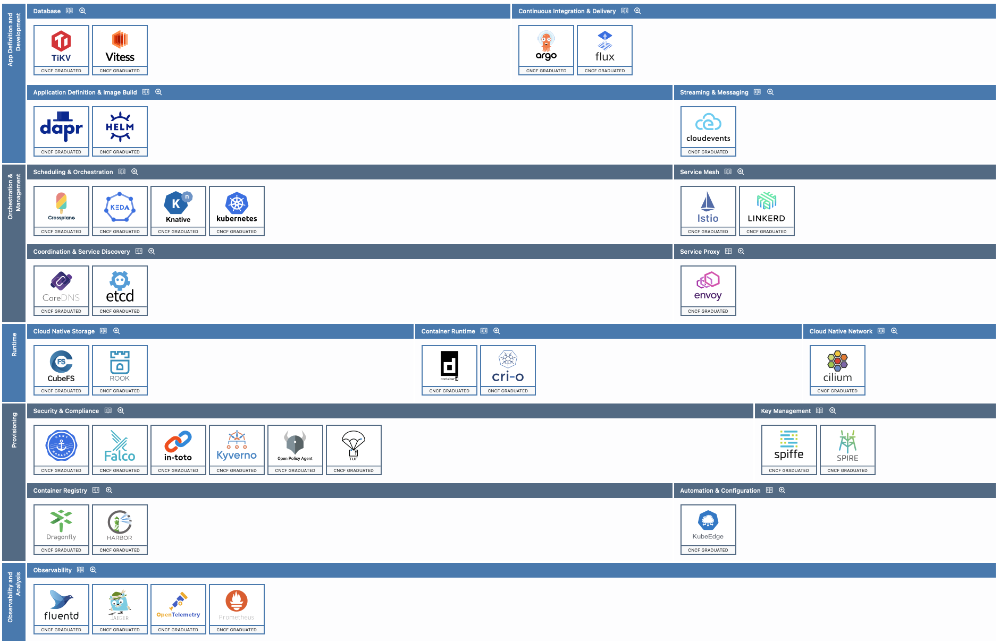
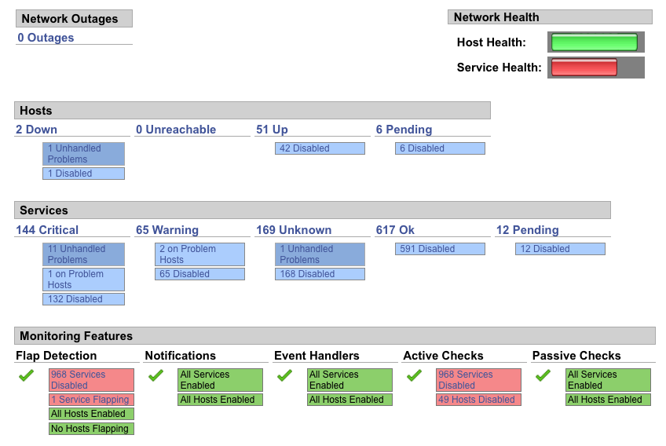

#+BIBLIOGRAPHY: ../bib plain

\begin{frame}[title={bg=Hauptgebaeude_Tag}]
  \maketitle
\end{frame}

#+begin_export latex
\newcommand{\cattle}[0]{
\includegraphics[height=2cm]{figures/cow.pdf}
}

\newcommand{\pet}[0]{
\includegraphics[height=2cm]{figures/pet.pdf}
}
#+end_export

* Practical: How to operate? 

*** From development to operations 

- Chapters so far: mostly concerned with development aspects
  - How to structure programs, how design protocols, \dots
- Little attention given to how to *run* these distributed programs in
  a large scale
  - We briefly touched on Docker and Kubernetes as preparation for the
    homework assignments
\pause
- *Operations* question: how to deploy, start, stop, monitor, scale,
  \dots large-scale distributed systems on large-scale
  infrastructures?
- How do development and operations nicely go hand in hand?
  - How to structure programs so that they can be well deployed?

*** Conventional approach: virtual machines 

- Virtual machines, manually configured 
  - Manual ~ssh~ to many \acp{VM}, careful attention to each individual
    server
    - *Snowflake servers* (Hodgson & Fowler): Each one looks different  \pause
- Virtual machines, automatically configured
  - Support tools for  *Infrastructure as Code* (IaC)
  - Configuration by automated tools
  - Infrastructure still can be changed: *Mutable infrastructure* 

*** Cloud-native: no individuals 

- Mutable infrastructure is risky: configuration drift, attention to
  individuals
- Alternative idea: just recreate from scratch, from description
  - *Phoenix Servers*  (Hodgson & Fowler): Recreated from the ashes 

*** Mental picture: Pet vs. cattle 

- Pets: you love your individual server and care for it \includegraphics[height=2cm]{figures/pet.pdf}
  - Think: Virtual machines 
- Cattle: servers are interchangeable and have no individual identity \includegraphics[height=2cm]{figures/cow.pdf}
  - Think: Containers, Pods, \dots
  - Often summarized under the *cloud native* umbrella 

**** PINGO!                                                       :B_alertblock:
     :PROPERTIES:
     :BEAMER_env: alertblock
     :END:
\pause
Pet vs. cattle: which property best describes 'cattle' servers? A) Individually maintained and repaired. B) Interchangeable, recreated from a description when broken.
*** Remaining chapter structure: Two worlds 

- Introduce the key questions for operating a distributed system
- With example approaches from both the *pets* and the *cattle* family
  - More formally: *mutable infrastructure* vs. *cloud-native infrastructure*
  - Roughly using CNCF as trail to follow
  - Not a perfect match between the two families, but it should work
    reasonably enough 
- Details on techniques, *how* these tools work: later chapters 

*** COMMENT Tasks  

We need to automate the following tasks: 

**** Installation, configuration 

- Obtaining virtual machines (or Docker or ...) 
- Installing operating system 
- Installing application plus libraries
- Installing accounts, permissions, secrets, ...

**** Managing 

- Booting, supervising, health check

**** Deployment 

- Building new application 
- Test new versions of an application (library, ...)
- Deploy new versions

*** COMMENT Categories 

- Configuration management 
  - More precise: System administration automation
- Build tools
  - Build script generation tools 
- Continuous integration tools 
- Monitoring systems 

*** Context: CNCF and its Landscape 
 
Reference picture by \ac{CNCF} (project of Linux Foundation to drive
cloud computing)
- [[https://landscape.cncf.io/guide][Landscape guide]]

#+caption: The Cloud native landscape 
#+attr_latex: :width 0.95\textwidth :height 0.6\textheight :options keepaspectratio
#+NAME: fig:cn:landscape
Too large for Moodle! Look at \url{https://landscape.cncf.io}

*** CNCF project levels 

- *Sandbox*: experimental, newly adopted; no claim about production-readiness
- *Incubating*: some real-world adoption, reasonable community base
  - Needs at least three independent production deployments,
    governance, security disclosure process
- *Graduated*: widely adopted, assumed to be long-term stable
  - E.g., Kubernetes, Helm 

*** Landscape of graduated projects

#+caption: The Cloud native landscape of graduated, open-source projects  \url{https://landscape.cncf.io} (as of 2026-06-08)
#+attr_latex: :width 0.95\textwidth :height 0.6\textheight :options keepaspectratio
#+NAME: fig:cn:landscape-graduated

*** Deutschland-Stack 

#+caption: The Cloud native landscape  @@latex: \textemdash{} @@ German version 
#+attr_latex: :width 0.95\textwidth :height 0.6\textheight :options keepaspectratio
#+NAME: fig:cn_deutschlandstack
[[./figures/deutschland-stack.pdf]]

*** Landscape categories  (following  [[https://landscape.cncf.io/guide][Landscape guide]])

\vskip-7ex
***** 
      :PROPERTIES:
      :BEAMER_env: block
      :BEAMER_col: 0.38
      :END:

      
- *Provisioning*
  - Automation & Configuration
  - Container Registry
  - Security & Compliance
  - Key Management
- *Runtime* 
  - Cloud-native storage
  - Container runtime
  - Cloud-native network 

***** 
      :PROPERTIES:
      :BEAMER_env: block
      :BEAMER_col: 0.58
      :END:   

- *Orchestration & Management*
  - Scheduling & Orchestration
  - Coordination & Service Discovery
  - Remote Procedure Call
  - Service Proxy
  - API Gateway 
  - Service Mesh
- *App Definitions and Development*
  - Database
  - Streaming & Messaging
  - Application Definition & Image Build
  - Continuous Integration & Delivery
- *Observability & Analysis*
  - Observability
  - Chaos Engineering 

*** Landscape categories 

#+caption: Landscape categories  (following  [[https://landscape.cncf.io/guide][Landscape guide]])
#+attr_latex: :width 0.95\textwidth :height 0.6\textheight :options keepaspectratio,page=1
#+NAME: fig:cncf_categories_mindmap
[[./figures/cloudnative_mindmap.pdf]]

\pause
Next couple of slides: brief highlights for these categories; more details later 

* Provisioning 

*** Question 1: Get an execution environment 

- Real hardware: Talk to your sys admin, procurement office, ... 
- A virtual machine:
  - Talk to sys admin, your cloud provider, ... 
  - Some hypervisors allow to request an empty VM
  - Install operating system
    - Talk to sys admin
- A Docker container, or Kubernetes pods 
  - Talk to your sys admin

*** Example: Amazon Elastic Cloud 

- To get a new virtual machine on a cloud, follow the cloud provider's
  instructions
  - Example
    \href{https://aws.amazon.com/getting-started/tutorials/launch-a-virtual-machine/}{Amazon Elastic Cloud}
  - Lots of clicking through web pages
  - Gives you at the end an IP address, key pair for ssh access 

*** Automation & configuration 

@@latex:   \begin{tikzpicture}[remember picture, overlay]
\node[anchor=north east, inner sep=4pt, xshift=-5cm,yshift=0.25cm]  at (current page.north east)  {\includegraphics[height=2.5cm, page=2]{figures/cloudnative_mindmap.pdf}};\end{tikzpicture}@@ 

- Create and configure resources (VMs, networks, \dots)
- Key idea: *Infrastructure as Code* (IaC)
  - Configurations are declared, not implemented step-by-step

*** Concept: Infrastructure as Code 

- Common theme: We can describe infrastructure by configuration files
  - Looks like "code"
  - With all aspects of code management: versioning, testing,
    repeatability, automation, ...
  - *No* interactive configuration! 
- Buzzword: *Infrastructure as Code*
  \cite{Fowler2016:InfrastrAsCode:online} 
  - Applies to computing, storage, networking
  - Could be scripts, declarative descriptions (like above)
  - Early examples
    \href{https://aws.amazon.com/about-aws/whats-new/2011/02/25/introducing-aws-cloudformation/}{AWS    Cloud Formation}  (2011) 
- Hoped-for benefits: cost, speed, risk 

**** PINGO!                                                       :B_alertblock:
     :PROPERTIES:
     :BEAMER_env: alertblock
     :END:
\pause
Infrastructure as Code explicitly FORBIDS one practice. Which? A) Storing config in version control. B) Interactive/manual configuration. C) Using declarative descriptions.
*** Example tools
  - Terraform: obtain resources from different Cloud providers
  - Ansible / Chef / Puppet: provision software, configuration files
    on such resources  (typically, virtual machines)

** Configuration without containers 

*** Question to solve 

- Goal: ensure the right software runs in the right version on the
  right hosts 
  - Nodes already run an operating system, have basic software, secret
    keys installed, ...
  - Example: how do I upgrade/downgrade all my webservers on
    the US east coast to Apache 2.1? Without the monitoring system to
    yell?   
- Common setup: one controlling host, configuring controlled nodes
- Same ideas as above: describe, make repeatable 

*** Approaches 

- Special software needed on hosts to be configured
  - \href{https://www.chef.io/chef/}{Chef},
    \href{https://puppet.com/}{Puppet},
    \href{https://saltstack.com/}{SaltStack}   
- Rely on ssh access alone
  - Example: Ansible (RedHat) 

*** Ansible 

- \href{http://www.ansible.com/}{Ansible}: Apache 2.0 software for actual
  configuration management  \pet
- Basic concepts:
  - Describe actions ("plays") to take place; YAML
  - Host list   
  - Playbooks -> plays -> tasks -> modules; handlers
  - Modules do actual work, lots of those (> 250)
    - E.g., module to drive Linux  package manager
    - E.g., module to interact with version control (git pull!) -
      continuous deployment! 

**** PINGO!                                                       :B_alertblock:
     :PROPERTIES:
     :BEAMER_env: alertblock
     :END:
\pause
Ansible playbooks describe tasks in which format?
*** Deployment tool example: Ansible Playbook with one play 

\small 
#+BEGIN_SRC yaml
- hosts: webservers
  vars:
    http_port: 80
  remote_user: root
  tasks:
    - name: ensure apache is at the latest version
      ansible.builtin.package:
        name: httpd
        state: latest
    - name: write the apache config file
      ansible.builtin.template:
        src: /srv/httpd.j2
        dest: /etc/httpd.conf
      notify: restart apache
    - name: ensure apache is running
      ansible.builtin.service:
        name: httpd
        state: started
#+END_SRC

** Terraform 

*** Example: Terraform  \pet

- Different cloud providers have different APIs
  - Annoying :-(
- \href{https://www.terraform.io}{Terraform} to the rescue: Hide
  different APIs behind a tool's common API
  - Can span an infrastructure across multiple cloud providers (e.g,
    AWS, Google, Azure, Alibaba)  
  - Open-source version: OpenTofu 
- Alternatives: e.g., [[https://www.pulumi.com][Pulumi]]   @@latex: \textemdash{} @@ IaC inside a
  programming language, not a Hashicorp-specific configuration
  language 

*** Terraform aspects 

- Write description files
- Plan changes before applying
- Make infrastructure reproducible 

*** Terraform example 

- Create a simple VM on AWS (from
  \href{https://developer.hashicorp.com/terraform/tutorials/aws-get-started/aws-create}{tutorial})

**** Configuration 

#+BEGIN_EXAMPLE
provider "aws" {
  region = "us-west-2"
}

data "aws_ami" "ubuntu" {
  most_recent = true

  filter {
    name = "name"
    values = ["ubuntu/images/hvm-ssd-gp3/ubuntu-noble-24.04-amd64-server-*"]
  }

  owners = ["099720109477"] # Canonical
}

resource "aws_instance" "app_server" {
  ami           = data.aws_ami.ubuntu.id
  instance_type = "t2.micro"

  tags = {
    Name = "learn-terraform"
  }
}
#+END_EXAMPLE

*** Terraform example 

In same directory as configuration file: 

**** Init 

#+BEGIN_SRC bash
$ terraform init
#+END_SRC

**** Apply 

Create a plan and execute it: 

#+BEGIN_SRC bash
$ terraform apply 
#+END_SRC

**** Results 

#+BEGIN_SRC bash 
$ terraform show 
#+END_SRC

** Transition to cloud-native 

*** From Ansible, Terraform to Cloud-Native infrastructures

- This is all nice and well  @@latex: \textemdash{} @@ but typical
  problems of mutable infrastructure
  - Snowflakes, configuration drift, \dots
- Instead: Make containers immutable; declare the result, not the way
  towards it 

*** Container registry 

@@latex:   \begin{tikzpicture}[remember picture, overlay]
\node[anchor=north east, inner sep=4pt, xshift=-5cm,yshift=-0.25cm]  at (current page.north east)  {\includegraphics[height=2.5cm, page=2]{figures/cloudnative_mindmap.pdf}};\end{tikzpicture}@@ 

- We already talked about registries in the Docker context 
- More examples: Dragonfly, Harbor (OCI compliant!) 

*** Security & compliance, key management 

@@latex:   \begin{tikzpicture}[remember picture, overlay]
\node[anchor=north east, inner sep=4pt, xshift=-5cm,yshift=-0.25cm]  at (current page.north east)  {\includegraphics[height=2.5cm, page=2]{figures/cloudnative_mindmap.pdf}};\end{tikzpicture}@@ 

- Harden, monitor, enforce platform and application security
  - Set compliance policies
  - Vulnerability insights, scanning 
  - Catch misconfigurations (e.g., overly permissive access rights)
  - Image signing 
- Key management
  - Create and distribute secrets/keys/authentication rules
    /authorization rules 

* Runtime 

*** Cloud-native storage 

@@latex:   \begin{tikzpicture}[remember picture, overlay]
\node[anchor=north east, inner sep=4pt, xshift=-5cm,yshift=-0.25cm]  at (current page.north east)  {\includegraphics[height=2.5cm, page=3]{figures/cloudnative_mindmap.pdf}};\end{tikzpicture}@@ 

- Persistent storage for containers, to be used for  databases, messages, \dots
  - Both the actual hardware as well as the interface to the storage
    system
  - Defines Container Storage Interface (CSI): file and block storage
    access for containers 
  - Automatically provisioned and scaled
- Examples: CubeFS, Rook

*** Containers and their orchestration

@@latex:   \begin{tikzpicture}[remember picture, overlay]
\node[anchor=north east, inner sep=4pt, xshift=-5cm,yshift=-0.25cm]  at (current page.north east)  {\includegraphics[height=2.5cm, page=3]{figures/cloudnative_mindmap.pdf}};\end{tikzpicture}@@ 

  - Container runtime (compare discussion in previous chapter)
    - Low-level: ~runc~, talks to Linux kernel, handles namespaces,
      cgroups, \dots
    - High-level: ~containerd~ (key part of Docker), deals with image
      pulling, volumes, networking across containers 

*** Cloud-native network 

@@latex:   \begin{tikzpicture}[remember picture, overlay]
\node[anchor=north east, inner sep=4pt, xshift=-5cm,yshift=-0.25cm]  at (current page.north east)  {\includegraphics[height=2.5cm, page=3]{figures/cloudnative_mindmap.pdf}};\end{tikzpicture}@@ 

- Typically, multiple interacting containers in one application
- Need to network internally and with external users, but usually not
  across applications
- Setup *overlay network* for such distributed applications, with
  privacy and resource control (and firewalls, \dots)
  - *Software-defined networking*
  - Uses *Container Network Interface* (CNI)
- Example tools: Cilium, Flannel, NSX-T 

* Orchestration 

**** PINGO!                                                       :B_alertblock:
     :PROPERTIES:
     :BEAMER_env: alertblock
     :END:
\pause
The Container Network Interface (CNI) is responsible for: A) Persistent storage. B) Overlay networks with isolation. C) Scheduling containers. D) Image building.
*** Orchestration & management: Scheduling 

@@latex:   \begin{tikzpicture}[remember picture, overlay]
\node[anchor=north east, inner sep=4pt, xshift=-5cm,yshift=-0.25cm]  at (current page.north east)  {\includegraphics[height=2.5cm, page=4]{figures/cloudnative_mindmap.pdf}};\end{tikzpicture}@@ 

- How to run containers on a cluster of machines? Think *cluster OS* 
- Scheduling & orchestration
  - ~Kubernetes~
    - Deploys, manages, scales, networks, \dots containers
    - Compare previous chapter  \pause
  - ~Knative~  on top of Kubernetes for serverless workloads, eventing
    workloads
    - Great for stateless workloads, less so for anything else 

**** PINGO!                                                       :B_alertblock:
     :PROPERTIES:
     :BEAMER_env: alertblock
     :END:
\pause
Kubernetes vs. Knative: for which workload type is Knative explicitly LESS suitable?
*** Orchestration & management: Coordination, service discovery 

@@latex:   \begin{tikzpicture}[remember picture, overlay]
\node[anchor=north east, inner sep=4pt, xshift=-5cm,yshift=-0.25cm]  at (current page.north east)  {\includegraphics[height=2.5cm, page=4]{figures/cloudnative_mindmap.pdf}};\end{tikzpicture}@@ 

- How to reach other containers that are part of your application?
  - E.g., they might run on different nodes at different point in time 
- *Service discovery*: Think logical database containing information
  about all running services
  - Consul, or parts of Kubernetes
  - Behind the scene: *etcd* as dependable, distributed key/value
    store 
- *Name resolution*: given the name of (e.g.) a container, how to reach
  it via (e.g.) an IP address?
  - Example: CoreDNS (part of Kubernetes)

*** Orchestration & management: RPC 

@@latex:   \begin{tikzpicture}[remember picture, overlay]
\node[anchor=north east, inner sep=4pt, xshift=-5cm,yshift=-0.25cm]  at (current page.north east)  {\includegraphics[height=2.5cm, page=4]{figures/cloudnative_mindmap.pdf}};\end{tikzpicture}@@ 

- Compare gRPC in previous chapter 

*** Orchestration & management: Service proxy 
@@latex:   \begin{tikzpicture}[remember picture, overlay]
\node[anchor=north east, inner sep=4pt, xshift=-5cm,yshift=-0.25cm]  at (current page.north east)  {\includegraphics[height=2.5cm, page=4]{figures/cloudnative_mindmap.pdf}};\end{tikzpicture}@@ 

- Conventional starting point: Applications need to deal with network
  traffic
  - Steer traffic to instances (e.g., to balance load), deal with encryption, TLS, gather
    statistics, \dots
  - Lots of that is boilerplate code
- Service proxies externalize that functionality from application
  - Making it generally accessible to build functions like service
    meshes on top 
  - Example: Envoy 

*** Orchestration & management: Application gateway  
@@latex:   \begin{tikzpicture}[remember picture, overlay]
\node[anchor=north east, inner sep=4pt, xshift=-5cm,yshift=-0.25cm]  at (current page.north east)  {\includegraphics[height=2.5cm, page=4]{figures/cloudnative_mindmap.pdf}};\end{tikzpicture}@@ 

- Application-level counterpart to service proxy:
  - Analyse requests
    made to an application's API
  - Check authorization, record statistics, \dots
- Removes boilerplate out of application code, centralizes it 
  
*** Orchestration & management:  Service mesh 
@@latex:   \begin{tikzpicture}[remember picture, overlay]
\node[anchor=north east, inner sep=4pt, xshift=-5cm,yshift=-0.25cm]  at (current page.north east)  {\includegraphics[height=2.5cm, page=4]{figures/cloudnative_mindmap.pdf}};\end{tikzpicture}@@ 

- Many services need to communicate with each other 
- Ensure dependable, observable, secure behavior  
  @@latex:   \textemdash{} @@ *without touching app code*
  - E.g., how to deal with a service becoming slow?
- Meshing at platform, not application level!
  - Should add: dependability/performance, observability, security by implementing
    in service proxies 
- Example: Istio, Linkerd 
- Also read [[https://www.buoyant.io/what-is-a-service-mesh][this blog]]
  - Explain that service meshes might solve organization problems
    (ownership, business vs. platform) rather than technical problems 

* App definition 

**** PINGO!                                                       :B_alertblock:
     :PROPERTIES:
     :BEAMER_env: alertblock
     :END:
\pause
What distinguishes a service mesh from a service proxy? Think: where is the functionality implemented — in the app, or at the platform level?
*** App definition: Database 
@@latex:   \begin{tikzpicture}[remember picture, overlay]
\node[anchor=north east, inner sep=4pt, xshift=-5cm,yshift=-0.25cm]  at (current page.north east)  {\includegraphics[height=2.5cm, page=5]{figures/cloudnative_mindmap.pdf}};\end{tikzpicture}@@ 

- Old school: SQL, MySQL, PostgreSQL
- Not only SQL: Couchbase
  - Compare later discussion about CAP theorem and how non-SQL DBs
    locate themselves in that design spectrum 
- Also: DBs that are Kubernetes-native 

    
*** App definition: Streaming & messaging 
@@latex:   \begin{tikzpicture}[remember picture, overlay]
\node[anchor=north east, inner sep=4pt, xshift=-5cm,yshift=-0.25cm]  at (current page.north east)  {\includegraphics[height=2.5cm, page=5]{figures/cloudnative_mindmap.pdf}};\end{tikzpicture}@@ 

- Assisting containers / apps to communicate, with simple interaction
  patterns
  - E.g., RabbitMQ, Kafka 
- See separate chapters on P2P and message queuing
- Also see: CloudEvents, NATS as example 

*** App definition: Image building 
@@latex:   \begin{tikzpicture}[remember picture, overlay]
\node[anchor=north east, inner sep=4pt, xshift=-5cm,yshift=-0.25cm]  at (current page.north east)  {\includegraphics[height=2.5cm, page=5]{figures/cloudnative_mindmap.pdf}};\end{tikzpicture}@@ 

- How to use, deploy, customize third-party apps together with your
  own app code?
  - Compare Ansible/Chef/Puppet, but also package managers like pip 
- Package manager: ~Helm~
  - Define applications comprising more than one
    container (/packaging/), YAML templates

*** App development: CI/CD 
@@latex:   \begin{tikzpicture}[remember picture, overlay]
\node[anchor=north east, inner sep=4pt, xshift=-5cm,yshift=-0.25cm]  at (current page.north east)  {\includegraphics[height=2.5cm, page=5]{figures/cloudnative_mindmap.pdf}};\end{tikzpicture}@@ 

- Continuous integration (CI)  
  \cite{Fowler2006:Continuo50:online} 
  - Whenever a change in code happens, e.g., in a repository, build a
    new version of an executable artefact
    - Also, run test code
    - (Buzzwords for software engineering: make, Makefile, test-driven
      development   \cite{Beck2002:TestDrivenDevelopment}, \dots)
  - Example from mutable infrastructure: ~Jenkins~ reacts to ~git push~, starts a pipeline to
    build a new container image
    - Often uses dedicated build servers

#+CAPTION: Continuous integration main workflow
#+ATTR_LaTeX: :width 0.95\linewidth
#+NAME: fig:ci_workflow
[[./figures/ci_workflow.pdf]]

**** PINGO!                                                       :B_alertblock:
     :PROPERTIES:
     :BEAMER_env: alertblock
     :END:
\pause
In Continuous Integration, what happens AUTOMATICALLY when a developer pushes code?
*** Continuous integration example: \href{http://jenkins-ci.org/}{Jenkins} 

 - Continuous integration server written in Java, server-based
 - Not hosted; you have to setup a server yourself 
   - Hosting available as extra service  
 - Integrates with common VC systems, tightly integrates with  Apache
   Maven as build system  
 - Various triggers for builds 
 - Non-trivial setup (especially for non-Maven projects) 

*** App development: CI/CD 
@@latex:   \begin{tikzpicture}[remember picture, overlay]
\node[anchor=north east, inner sep=4pt, xshift=-5cm,yshift=-0.25cm]  at (current page.north east)  {\includegraphics[height=2.5cm, page=5]{figures/cloudnative_mindmap.pdf}};\end{tikzpicture}@@ 

 
- Continuous delivery (CD) 
  - On top of CI, deploy an executable to production systems
  - Which version, coexistence of multiple versions, \dots
  - How to decide when a version can/should be pushed at all 
- CI/CD: push-based, pipeline triggers scripts, kubectl commands,
  etc. 

*** App development: GitOps 
@@latex:   \begin{tikzpicture}[remember picture, overlay]
\node[anchor=north east, inner sep=4pt, xshift=-5cm,yshift=-0.25cm]  at (current page.north east)  {\includegraphics[height=2.5cm, page=5]{figures/cloudnative_mindmap.pdf}};\end{tikzpicture}@@ 

- GitOps: Git is only source of truth for deployment
  - Agent in Kubernetes cluster watches git repo, reacts to changes by
    pulling them in
  - *No other changes* to environment allowed, *only* via repo
    - Manual changes to environment are automatically rolled back 
\pause
- Common combination:
  - Push-based CI/CD for development and testing stages
    - With dedicated testing clusters
  - Pull-based for production 
\pause
- Typical example: GitHub Actions  @@latex: \textemdash{} @@  no server to maintain, pipelines as code (~.github/workflows/~)

**** PINGO!                                                       :B_alertblock:
     :PROPERTIES:
     :BEAMER_env: alertblock
     :END:
\pause
In GitOps, someone manually scales the cluster with kubectl. What does the GitOps agent do?
*** App development: GitOps, ArgoCD  
@@latex:   \begin{tikzpicture}[remember picture, overlay]
\node[anchor=north east, inner sep=4pt, xshift=-5cm,yshift=-0.25cm]  at (current page.north east)  {\includegraphics[height=2.5cm, page=5]{figures/cloudnative_mindmap.pdf}};\end{tikzpicture}@@ 

- Example: ~ArgoCD~: Uses Git as /single source of truth/,
  - Synchronizes cluster with Git-based specification
  - Observes Git repo, notices new image, calls ~Helm~ for the
    template, deploys new version 
  - Also heals changes made to a cluster by reverting back to what
    is in Git, rollbacks to earlier configs, \dots 
  - Multi-cluster-capable
- Often: two repos, one for actual app (~Dockerfile~), one for
  configuration  (~Helm~ charts, K8 clusters for development,
  staging, production, \dots)

* Observability  

*** Observability 
@@latex:   \begin{tikzpicture}[remember picture, overlay]
\node[anchor=north east, inner sep=4pt, xshift=-5cm,yshift=-0.25cm]  at (current page.north east)  {\includegraphics[height=2.5cm, page=6]{figures/cloudnative_mindmap.pdf}};\end{tikzpicture}@@ 

- Metrics collection: ~Prometheus~
  - Deals with time-series, triggers alerts, heart-beating, \dots
  - Mostly numerical values,  pull-based
- Visualization: ~Grafana~
  - Build cute dashboards on top of ~Prometheus~ data 
- Logging: ~Fluentd~
  - Collect (text-based) logs from cluster, ships to central location,
    push-based 
- Tracing: ~Jaeger~
  - Journey of a request through graph of microservices, debugging aid 

\pause

*Three pillars of observability* 
- Metrics, logs, traces 
- Realized by (e.g.) Prometheus, Fluentd, Jaeger
- Grafana for pretty dashboards on top 

 

**** PINGO!                                                       :B_alertblock:
     :PROPERTIES:
     :BEAMER_env: alertblock
     :END:
\pause
The three pillars of observability: what are they?
*** Example from mutable infrastructure: Nagios 

\href{https://www.nagios.org}{Nagios}   \pet

- Open-source (collection of) software to monitor servers, networks,
  applications
- Flexible plugins
- Flexible alerts and reports
- Some support for capacity planning 
- Structure: Nagios server tries to access supervised systems,
  services 

* Further reading      

*** Kubernetes: Custom resources and operators 

- Kubernetes is *not* a fixed system
- Think of it as an extensible framework 
- Important concept: Custom resources and their descriptors
  - *Custom Resource Descriptors* (CRDs)
- Along with *operators* that observe changes to a custom resource in
  reconciliation loop
  - Have algorithms  to bring reality towards desired state
\pause
- Example: ~Database~ CR, with operators that spin up replicas in new
  pods, sync between them, backup data, \dots 

**** PINGO!                                                       :B_alertblock:
     :PROPERTIES:
     :BEAMER_env: alertblock
     :END:
\pause
In Kubernetes, what does an Operator implement? A) A web UI. B) A reconciliation loop. C) A replacement for etcd. D) Auto-scaling on CPU only.
* COMMENT OLD STUFF FOLLOWS 

* COMMENT Build tools 

*** Question to solve 

- A big software artefact (library, application, ...) consists of many
  files
- After change: how to make sure you compile all the files affected by
  the change?
  - Compile all? Too much overhead
  - Identify dependencies
- Recompile, link based on these dependencies 

*** Build tool types 

- Dependency-based: specify which file depends on which other one
  - Meaning: dependent file as to be recreated if depended-upon file
    changes
  - Usually detected via modification date
- Rule-based: to a file of type X from a file of type Y, do the
  following
- Typically, mixture of the two 

*** Example: Make 

- GNU ~make~ - granddaddy of all build tools
- Specifies both dependencies and rules
  - Many rules are built-in

*** Example Makefile 

#+BEGIN_EXAMPLE
# Where is the settings file? PAth is relative to the main directory SETTINGS = settings.cfg

LATEXBIN = pdflatex -interaction=nonstopmode
BINPATH = bin/
LATEXPATH = latex/

.PHONY: proposal pdf clean

proposal:
        cd ${BINPATH} ; python make.py

pdf:
        cd ${LATEXPATH}; ${LATEXBIN} MainPage; bibtex MainPage; ${LATEXBIN} MainPage; ${LATEXBIN} MainPage 
        cp ${LATEXPATH}/MainPage.pdf ${PROJECTNAME}.pdf

#+END_EXAMPLE

*** Generating makefile 

- Many dependencies can be automatically detected
  - E.g., ~a.c~ includes ~b.h~ creates a dependency
  - No need to specify all that by hand, use tool
  - Often called ~makemake~
- Various tools 
  - ~configure~
    - Typical ~./configure; make; make install~ workflow 
  - ~autoconf~, ~automake~: create Makefiles depending on current
    architecture, operating system
  - ~qmake~, for Qt framework
  - ~Meson~, ... 

*** Non-make based 

- Plenty of tools, often specialised for particular languages,
  frameworks, ...
- Examples:
  - \href{https://en.wikipedia.org/wiki/Apache_Maven}{Maven} for Java 
  - \href{https://en.wikipedia.org/wiki/Cabal_(software)}{Cabal} for
    Haskell applications
  - \href{https://en.wikipedia.org/wiki/SCons}{SCons}

* COMMENT Continuous integration tools 

   

* COMMENT Monitoring systems 

** Categories 

*** Question to solve 

- So you have deployed hundreds of servers running your hot Web
  application
- Are you sure your *servers* (bare metal or virtual) are still up and
  running?
  - Beware: impossibility of perfect failure detectors
- Are you sure your *services* are still running?
  - Basic system (HTTP, SSH, ...) as well as application? 
  - If when your servers are up
- Are you sure your *performance* is as expected? 

#+BEAMER: \pause
You need online monitoring! 

*** Example: \href{https://www.nagios.org}{Nagios} 

- Open-source (collection of) software to monitor servers, networks,
  applications
- Flexible plugins
- Flexible alerts and reports
- Some support for capacity planning 
- Structure: Nagios server tries to access supervised systems,
  services 

*** Nagios tactical map 

From \href{http://nagioscore.demos.nagios.com/nagios/}{Nagios Core demo}: 

#+CAPTION: Nagios tactial map screenshot 
#+ATTR_LaTeX: :width 0.95\linewidth
#+NAME: fig:nagios_tactical

*** Log aggregation 

- Imagine you have thousands of VMs/Containers
- Each produces log files: the OS, the server processes, the
  application processes
- Do you really want to manually log in to all of them, one by one?

#+BEAMER: \pause

**** Log aggregation                                           :B_definition:
     :PROPERTIES:
     :BEAMER_env: definition
     :END:

The process of collecting logs from disparate systems at a single
site, with proper performance and dependability (and possibly
real-time) guarantees.

*** Single-site log aggregation 

- First step: Aggregates logs on a single machine
  - Instead of each process writing a text file in some weird
    location
- Buzzword: syslogd and friends 

*** Distributed example: GrayLog 

- Example system: \href{https://www.graylog.org}{GrayLog}
- Comprises
  - Actual collecting system
  - Search support (ElasticSearch)
  - Configuration database 
- Enterprise grade
  - Worry about security, compliance with regulations, ... 
- Architecture: We need more mechanisms, first 

* Summary

*** Summary 

- Practical tool knowledge goes a long way to  efficient
  deployments
- Tools impact workflows for developers and operations 

**** DevOps 

- Integrating both development and operations into a single process 
- More an organisational than a technical aspect 
  - Ties in technically with CI/CD: one team develops and deploys 

**** BizDevOps

- Also consider business aspects as part of the loop
