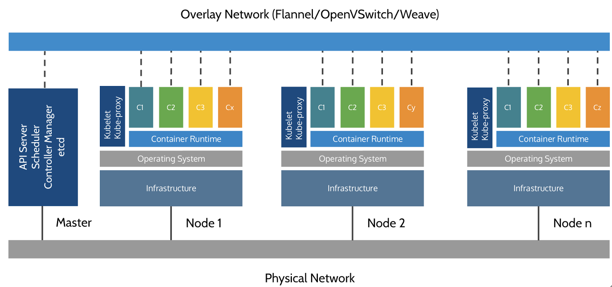
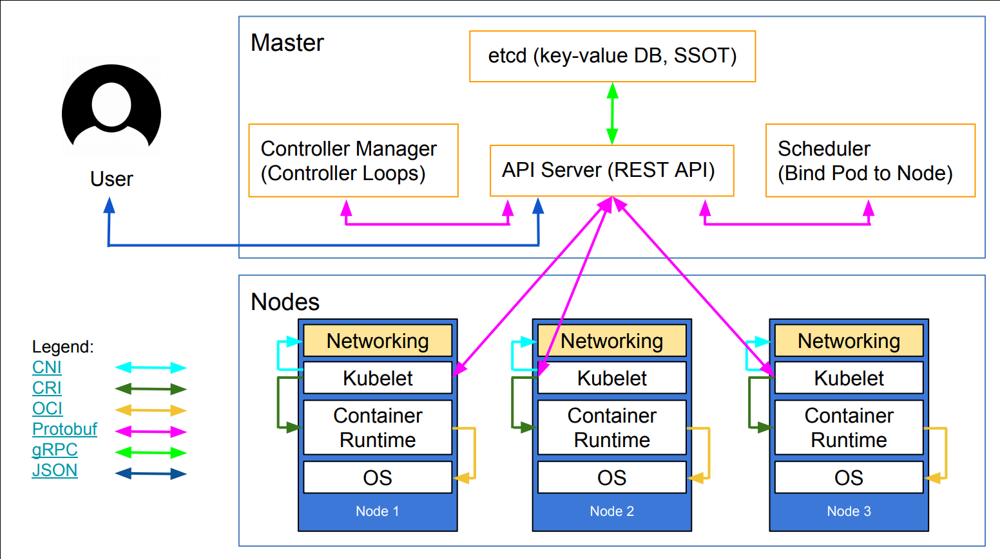
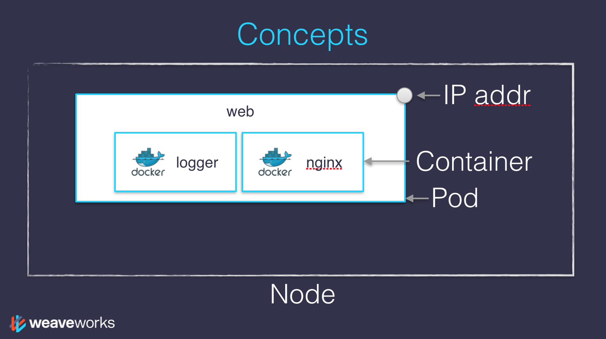

#+BIBLIOGRAPHY: ../bib plain

\begin{frame}[title={bg=Hauptgebaeude_Tag}]
  \maketitle
\end{frame}

* Containers 

*** Recall: Virtualization 

Typical examples: 
- Virtualize a CPU: processes 
- Virtualize memory: page-based virtual memory (e.g.)
- Virtualize an entire system: virtual machines (e.g., Virtualbox)
\pause

Middle ground? 
- What if flexibility of virtual machines is not needed
  - E.g., different operating systems
- But the handling of processes is impractical
  - E.g., different library versions are needed, port numbers overlap
    between different applications, \dots 

*** Isolation better than processes: Namespaces   

- Isolate kernel resources between different processes: *Linux
  namespaces*
  - Basically, per-namespace copy of kernel-internal data structures
- Separate namespaces for different types of resources: process IDs, networks,
      hostnames, user names, mount points, IPCs, cgroups (compare
      e.g. \url{https://www.redhat.com/en/blog/7-linux-namespaces})
- For example: 
  - Different ~/etc/hosts~ in different namespaces, via the ~mount~ namespace
  - Different routing tables in different namespaces 

*** Better resource control for processes: ~cgroups~ 

- Give explicit resource limits to processes
  - Typically: CPU, memory, I/O data rate 
- Allows both hard limits and relative weights
- Details: Operating systems, in particular, the Completely Fair
  Scheduler; token buckets for I/O; \dots 

*** Better dependency control

- Problem: system libraries, application libraries in different
  versions, \dots might live
  in central locations
  - Used by dynamic linking at process start
- In principle, no problem: each application could carry along all
  dependencies
  - Even statically linked
- But hugely inefficient 
\pause
- How to share files in a controlled manner?
  - Mostly, a distribution & deployment problem 

*** Better dependency control in file system 

- Present a process with its own subtree of the file system, acting as
  root
- Enables different versions of libraries to coexist, but for the
  processes, it still looks like they access, e.g., ~/usr/lib~ from
  root on downwards
\pause
- Cool idea, but: security flaws, still inefficient 
  - Improved upon by ~pivot_root~; typical tool today  

*** Flexibly sharing, reusing files? 

- Suppose: three applications, all sharing same Ubuntu libraries, but
  one needs different python version, \dots 
- Idea: construct a file system out of *reusable layers*, combinable
  into a final, unified file system
  - A *union file system*: the actual file system in use is the union
    of the respective individual layers 
- Usually, read-only (modifying breaks reusability)
  - Last layer, typically read/write, in a copy-on-write sense 
- Typical example: ~OverlayFS~, cmp e.g. 
  \url{https://docs.kernel.org/filesystems/overlayfs.html} 

*** Key ingredients in place 

- Isolation & visibility of resources to processes via ~namespaces~
- Control over resource allocation via ~cgroups~
- Efficient distribution of similar yet not identical applications via
  ~union filesystems~ like ~OverlayFS~ 
\pause
- But: cumbersome to use manually -- wrap it into a neat package? 

*** Neat package: Docker 

Puts all of that together
- *Images*: distributable layered file systems; composition of layers is
  explicitly maintained and used to speed up, e.g., downloading
- *Repository*: collection of useful images
- *Container*: a running instance of an image (corresponds to process)
- *Dockerfile*: describes how an image is constructed and how it
  should be run 

*** Docker runtime support  

    - Low-level: ~runc~, talks to Linux kernel, handles namespaces,
      cgroups, \dots
    - High-level: ~containerd~ (key part of Docker), deals with image
      pulling, volumes, networking across containers 

*** Dockerfile example 

\vskip-3ex
\footnotesize

***** Build stage 
      :PROPERTIES:
      :BEAMER_env: block
      :BEAMER_col: 0.48
      :END:

(Note the ~AS builder~ statement)
      
#+begin_src sh
  

# ── Build stage ───────────────────────────────────────────────────────────────
FROM python:3.13-slim AS builder
WORKDIR /app
COPY requirements.txt .
RUN pip install --prefix=/install --no-cache-dir -r requirements.txt

#+end_src

***** Runtime stage 
      :PROPERTIES:
      :BEAMER_env: block
      :BEAMER_col: 0.48
      :END:   

(Note the ~COPY --from=builder~ statement)

#+begin_src sh

# ── Runtime stage ─────────────────────────────────────────────────────────────
FROM python:3.13-slim
RUN addgroup --system app && adduser --system --ingroup app app
WORKDIR /app
COPY --from=builder /install /usr/local
COPY app.py .
COPY templates/ templates/
RUN mkdir -p data && chown app:app data
VOLUME ["/app/data"]
USER app
EXPOSE 5000

# Run the actual server
CMD ["python", "app.py"]
#+end_src

*****                               :B_ignoreheading:
      :PROPERTIES:
      :BEAMER_env: ignoreheading
      :END:

*** Docker registry 

Where to find useful Docker images? 
- At public registries, e.g., [[https://www.docker.com/products/docker-hub/][Docker Hub]]
- At your own registries, e.g., tied to a ~gitlab~ repository
  - Cmp. e.g. [[https://docs.gitlab.com/user/packages/container_registry/][GitLab container registry]]
  - Needs some local setup to push to / pull from these repos

*** Container virtualization summary 

- Think of containers as deployment units, not (primarily) as
  virtualization approaches
- Very lightweight, barely heavier than a normal process
  - Especially when idle: near-zero CPU or I/O cost; just resident memory 
- There are other tools, besides Docker: Linux containers, FreeBSD
  Jails, Podman 

*** Towards standardization: \gls{OCI}

Standardize: 
- How an image looks like as a file 
- How to distribute images
- What to do at runtime  @@latex: \textemdash{} @@ ~runc~ as reference
  implementation 

* Groups of Containers 

*** Applications more complex than a single process/container? 

- E.g., how to deploy a typical web application with a web server, a
  web application framework, and a data base? 
- Natural idea: one container per component 
- But how to package together? 

*** Compose containers together: docker-compose 

***** Idea 
      :PROPERTIES:
      :BEAMER_env: block
      :BEAMER_col: 0.48
      :END:

- Describe how multiple containers belong together to form a useful
  application 
- E.g., how to connect ports internally and to external users 
- Example describes two services: web and app 
- Operate: ~docker compose up~       
  - Access localhost:8000

***** ~docker-compose.yaml~ (from https://docs.docker.com/compose/gettingstarted/)
      :PROPERTIES:
      :BEAMER_env: block
      :BEAMER_col: 0.48
      :END:   

#+begin_src sh
  services:
  web:
    build: .
    ports:
      - "8000:5000"
    environment:
      - REDIS_HOST=${REDIS_HOST}
      - REDIS_PORT=${REDIS_PORT}

  redis:
    image: redis:alpine
#+end_src

* Kubernetes 

*** From a few to MANY containers/apps? 

- Imagine you have to run hundreds of applications, using thousands of
  containers, running on dozens of servers, used by tens of thousands
  of users? 
- Nightmare of dealing with
  - Failures and bugs
  - Load variation
  - Upgrades
  - Competition for resources 
  - .... 
\pause
- Additional support? 

*** Kubernetes 

- Emerged out of a Google internal project to manage data center
  resources (Borg)
- Tool to do just that: hundreds of containers on dozens of machines,
  \dots 

\pause
- Material in this section mostly follows
  \cite{petazzoni19:_gettin_start_with_kuber_contain_orches},
  [[https://github.com/jpetazzo/container.training][container.training]]
  - More material at the end 

*** Basic things we can ask Kubernetes to do \cite{petazzoni19:_gettin_start_with_kuber_contain_orches}

- Start 5 containers using image =atseashop/api:v1.3=
- Place an internal load balancer in front of these containers
- Start 10 containers using image =atseashop/webfront:v1.3=
- Place a public load balancer in front of these containers
- It's Black Friday (or Christmas), traffic spikes, grow our cluster and
  add containers
- New release! Replace my containers with the new image
  =atseashop/webfront:v1.4=
- Keep processing requests during the upgrade; update my containers one
  at a time

*** More things \cite{petazzoni19:_gettin_start_with_kuber_contain_orches}

- Different job patterns: long-running services, batch jobs,
  overcommitted clusters

- Deploy a pre-production environment

- Resource management and scheduling
  (reserve CPU/RAM for containers; placement constraints; priorities)

- Autoscaling
  (straightforward on CPU; more complex on other metrics)

- Advanced rollout patterns
  (blue/green deployment, canary deployment)

*** Kubernetes architecture  @@latex: \textemdash{} @@ rough idea 

#+caption: Simplified Kubernetes architecture (Courtesy of
  [[https://medium.com/containermind/a-reference-architecture-for-deploying-wso2-middleware-on-kubernetes-d4dee7601e8e][Imesh  Gunaratne]])
#+attr_latex: :width 0.95\textwidth :height 0.6\textheight :options keepaspectratio
#+NAME: fig:label

*** Kubernetes architecture: the nodes
:PROPERTIES:
:CUSTOM_ID: kubernetes-architecture-the-nodes
:END:
- The nodes executing our containers run a collection of services:

  - a container Engine (~containerd~, CRI-O)

  - kubelet (the "node agent")

  - kube-proxy (a necessary but not sufficient network component)

*** Kubernetes architecture: the control plane
     :PROPERTIES:
     :CUSTOM_ID: kubernetes-architecture-the-control-plane
     :END:
- The Kubernetes logic (its "brains") is a collection of services:

  - the API server (our point of entry to everything!)

  - core services like the scheduler and controller manager

  - =etcd= (a highly available key/value store; the "database" of
    Kubernetes)

- Together, these services form the control plane of our cluster

*** How many nodes should a cluster have?
     :PROPERTIES:
     :CUSTOM_ID: how-many-nodes-should-a-cluster-have
     :END:

- There is no particular constraint

- A cluster can have zero node (but then it won't be able to start any pods)

- For testing and development, having a single node is fine

- For production, make sure that you have extra capacity 
  (so that your workload still fits if you lose a node or a group of
  nodes)

- Kubernetes is tested with   [[https://kubernetes.io/docs/setup/best-practices/cluster-large/][up to 5000 nodes]]
  - However, running a cluster of that size requires a lot of tuning

*** Kubernetes architecture  @@latex: \textemdash{} @@ second approximation 

#+caption: More details
#+attr_latex: :width 0.95\textwidth :height 0.6\textheight :options keepaspectratio
#+NAME: fig:k8s-arch-v2

*** Kubernetes: Nodes, pods, containers 

- A node hosts pods, a pod hosts containers
- Pod: smallest deployable unit 
  - Pods have own IP address, shared by all its containers, in one big flat IP network \pause
    - Expose a pod (~kubectl expose~) to give it a stable address
      -- turn it into a *service*; with entry in ~CoreDNS~
    - Expose either only cluster-internally (~ClusterIP~), externally
      (~NodePort~), or behind a ~LoadBalancer~
    - Think of a pod as a virtual host for a containers belonging to
      the same app 
  - Similarly: all containers share storage and lifecycle
  - A pod never moves between nodes

*** Kubernetes: Nodes, pods, container, picture  

#+caption: Nodes, pods, containers 
#+attr_latex: :width 0.95\textwidth :height 0.5\textheight :options keepaspectratio
#+NAME: fig:2

*** How many containers per pod? 

- Usually: one-to-one 
- Sometimes: multiple containers
  - If tightly coupled (only able to run together)
  - Patterns:
    - Sidecar: e.g., log shipper
    - Ambassador: proxy to intercept network, adapt to desired format
    - Adaptor: adapt, e.g., log formats

*** Persistent storage 

- Dockerfile: we saw the VOLUME for persistent storage 
- In Kubernetes
  - Persistent volumes (PV): Resources similar to nodes, but with
    independent lifetimes
  - Persistent volume claims (PVC): request PV storage
- Analogy: PVC : PV = Pod : Node 

   

*** From pods to deployments 

- Usually, pods are not created manually
- Typically, a *deployment* is described
  - Which containers are included?
  - Which port numbers are used?
  - Replication for fault tolerance?
    - Resulting in multiple pods 
- Deployment declares how an application should be run, possible on
  multiple pods, possibly using multiple containers 

*** Declarative approach 

- Kubernetes thinks in declarative terms: What do you want?
  - Not: how do you get there? 
- Tea example: /I would like a cup of tea./ \pause
  - I want a cup of tea, obtained by pouring an infusion¹ of tea
    leaves in a cup. \pause
  - ¹An infusion is obtained by letting the object steep a few minutes
    in hot² water. \pause
  - ²Hot liquid is obtained by pouring it in an appropriate container³
    and setting it on a stove. \pause
  - ³Ah, finally, containers! Something we know about. Let's get to
    work, shall we? 

*** Declarative approach: YAML examples 

\vskip-3ex
\tiny 

***** Deployment 
      :PROPERTIES:
      :BEAMER_env: block
      :BEAMER_col: 0.48
      :END:

#+begin_src sh
apiVersion: apps/v1
kind: Deployment
metadata:
  name: itemstore
  namespace: itemstore
  labels:
    app: itemstore
spec:
  replicas: 1              # SQLite + ReadWriteOnce PVC = only 1 replica safe
  selector:
    matchLabels:
      app: itemstore
  template:
    metadata:
      labels:
        app: itemstore
    spec:
      containers:
        - name: itemstore
          image: itemstore:latest
          imagePullPolicy: Never   # use locally-built image in minikube
          ports:
            - containerPort: 5000
# ... [snip] ... 
      volumes:
        - name: data
          persistentVolumeClaim:
            claimName: itemstore-data
#+end_src

      

***** COMMENT Deployment 
      :PROPERTIES:
      :BEAMER_env: block
      :BEAMER_col: 0.48
      :END:

#+begin_src sh
apiVersion: apps/v1
kind: Deployment
metadata:
  name: itemstore
  namespace: itemstore
  labels:
    app: itemstore
spec:
  replicas: 1              # SQLite + ReadWriteOnce PVC = only 1 replica safe
  selector:
    matchLabels:
      app: itemstore
  template:
    metadata:
      labels:
        app: itemstore
    spec:
      containers:
        - name: itemstore
          image: itemstore:latest
          imagePullPolicy: Never   # use locally-built image in minikube
          ports:
            - containerPort: 5000
          env:
            - name: DATABASE_URL
              value: sqlite:////app/data/items.db
            - name: SECRET_KEY
              valueFrom:
                secretKeyRef:
                  name: itemstore-secret
                  key: secret-key
          volumeMounts:
            - name: data
              mountPath: /app/data
          readinessProbe:
            httpGet:
              path: /health
              port: 5000
            initialDelaySeconds: 5
            periodSeconds: 10
          livenessProbe:
            httpGet:
              path: /health
              port: 5000
            initialDelaySeconds: 15
            periodSeconds: 20
          resources:
            requests:
              cpu: "100m"
              memory: "128Mi"
            limits:
              cpu: "500m"
              memory: "256Mi"
      volumes:
        - name: data
          persistentVolumeClaim:
            claimName: itemstore-data

#+end_src

      
***** Service 
      :PROPERTIES:
      :BEAMER_env: block
      :BEAMER_col: 0.48
      :END:   

#+begin_src sh
  apiVersion: v1
kind: Service
metadata:
  name: itemstore
  namespace: itemstore
spec:
  selector:
    app: itemstore
  ports:
    - port: 80
      targetPort: 5000
  type: ClusterIP

#+end_src

*****                               :B_ignoreheading:
      :PROPERTIES:
      :BEAMER_env: ignoreheading
      :END:

*** Continuous reconciliation 

Control continuously checks, compares: 
- Declaration of *desired* state of your cluster 
- Observation of *actual* state
- If different: Kubernetes tries to *reconcile* actual state towards desired
  state -- it *converges eventually*
  - Could take seconds, minutes (with no timeliness guarantees)
\pause
- Consequence: if you, e.g.,  need additional resources, change the
  description, not the state
  - E.g., a ~kubectl delete somePod~ just causes a new one to be restarted
- Details: \cite{Hausenblas2019-nv}

*** Reconciliation: Example 

- Imagine a deployment asks for a replication level of three 
  - Results in three pods
- Node fails, detected by control plane
- Failed pods are spun up on another node, until required redundancy
  is re-established 

*** Separation of configuration data 

- Typical approach: Write configuration files using parameters, not
  fixed values
  - Adapt parameters depending on whether app runs in development,
    testing, production
- ~ConfigMap.yaml~ is default place to store such parameter values
  - Same app, same files, except for different ConfigMaps
- Values loaded into environment variables 
- Basically: *Store config in the environment* (Rule 3 of 12 factors) 

*** Running the control plane outside containers
     :PROPERTIES:
     :CUSTOM_ID: running-the-control-plane-outside-containers
     :END:
- The services of the control plane can run in or out of containers
- For instance: since =etcd= is a critical service, some people deploy
  it directly on a dedicated cluster (without containers)
  - (This is illustrated on the first "super complicated" schema)

- In some hosted Kubernetes offerings (e.g. AKS, GKE, EKS), the control
  plane is invisible
  - (We only "see" a Kubernetes API endpoint)

*** Kubernetes: Next steps 

- Deploy containers in pods 
- Make them accessible as services 
- Put some load onto them (e.g., ~httping~)
- Configure autoscaling 
- See Lab assignments! 
- Helm to manage packages: see later chapters 

*** Kubernetes: Further reading 

- There are tons of introductions, slide sets, \dots on Kubernetes
  around 
- Recommendation: Pick one with actual practice material along with it
  - Like learning to ride a bike \dots 
- Possible options:
  - [[https://github.com/jpetazzo/container.training][container.training]]  @@latex: \textemdash{} @@
    maybe the best one?
    - Most of the slides in this case study follow this material! 
  - Kubernetes basic tutorial
    \url{https://kubernetes.io/docs/tutorials/kubernetes-basics/} 
  - [[https://learnkube.com][LearnKube]]
- Twelve-factor app  @@latex: \textemdash{} @@  talk to your software engineering instruction
  :-) 
- \gls{CNI}  @@latex: \textemdash{} @@ how to realize the various
  ports, tunnels, network connectivity 

*** Try it yourself 
  - Minikube! \url{https://minikube.sigs.k8s.io/docs/}
  - Or go the Talos route:
    \url{https://docs.siderolabs.com/talos/}

